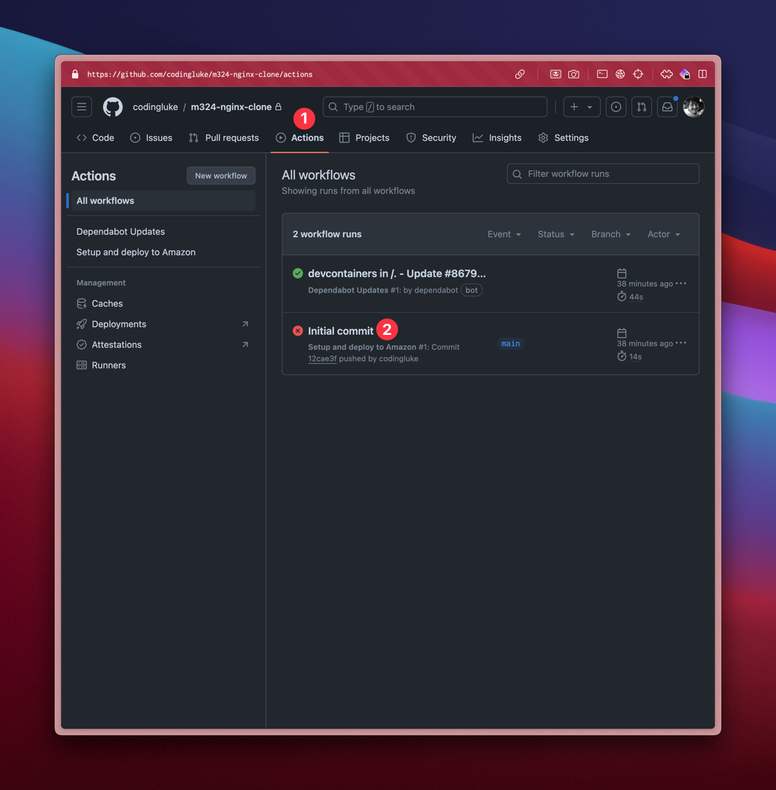
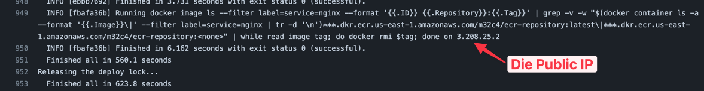
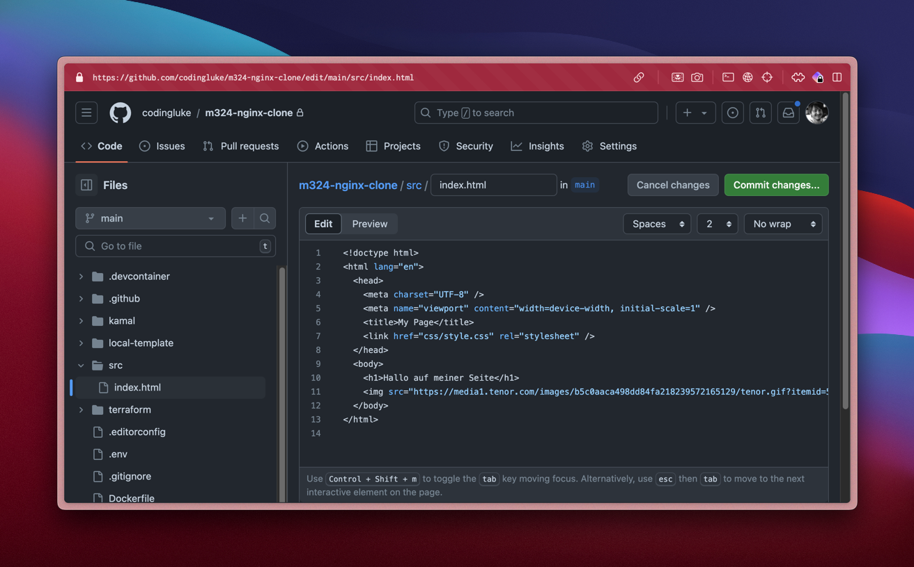

# Nginx Beispiel App

Das Modul verfolgt das Prinzip, **_make-it-work_, _then-make-it-yours_**. Dies
heisst es existiert ein funktionsfähiges, minimales Beispielprogramm. In diesem
Fall ist es ein einfachen [nginx](https://nginx.org/en/) Webserver, welcher über
ein GitHub Template Repository von jedem Lernenden geklont und dann individuell
angepasst wird.

:::tip Ziel

- Das Ziel vom Modul ist es, dass jeder mindestens diese Beispiel App verstanden
  hat 🥳

:::

## Aufgaben

### Das Template `bbzbl-modul-324-nginx` klonen

- In den GitHub Account einloggen
- [https://github.com/codingluke/bbzbl-modul-324-nginx](https://github.com/codingluke/bbzbl-modul-324-nginx)
  aufrufen
- "Use this Template" -> "Create a new repository" wählen
  
- Formular ausfüllen
  
  - Der Name dürft Ihr selber wählen.
  - Bitte **"Private"** auswählen, später mir (codingluke) berechtigen
  - Mit **"Create Repository"** bestätigen

### AWS Credentials in Repository Environment Variablen übertragen

- Im neu erstellten Repository auf **"Settings" -> "Secrets and variables" ->
  "Actions"** navigieren
- Auf **"New Repository secret"** klicken
  
- Für alle Einträge unter **"AWS Details"** ein Secret erstellen, es sollten **5
  Secrets** existieren
  - AWS_ACCESS_KEY_ID
  - AWS_SECRET_ACCESS_KEY
  - AWS_SESSION_TOKEN
  - AWS_SSH_PRIVATE_KEY
    
  - AWS_ACCOUNT_ID
    

### GitHub Action neu starten

Es wird automatisch, bei einer Änderung auf dem Branch `main` eine
[GitHub Action](https://docs.github.com/en/actions) gestartet. Diese ist
garantiert rot, da die Secrets gefehlt haben.

Nun, da diese übertragen wurden, können wir die Action neu starten.

- Nach **"Actions"** navigieren
- Die fehlgeschlagene Action **"Inital commit"** auswählen
  
- **"Re-run jobs"** starten
  
- **Warten, und warten** bis...
  

### Webseite in Browser öffnen

Nun ist die Web-App auf AWS ausgeliefert und öffentlich verfügbar.

- Kopiert die Public-IP ganz am Ende vom "output".
  
- öffnet in einem Browser "http://eure-ip"
  

:::info HTTP ist unsicher...

- Es handelt sich um **http** und nicht httpswenn
- Wenn euer Browser motzt, evt. Firefox verwenden.

:::

### HTML bearbeiten

Nun ist es möglich Änderungen an der App vorzunehmen, welche automatisch auf AWS
deployed werden!

- Navigiert zu **"Code -> src -> index.html"** und klickt auf **"Edit"**
  
- Ändere die Seite nach belieben ab
  

  :::tip Beispiel Änderung

  ```html
  
  ```

  :::

- Änderungen "commiten". Die Nachricht ist noch nicht wichtig.
  
- Warten bis die GitHub Actions fertig sind
  

