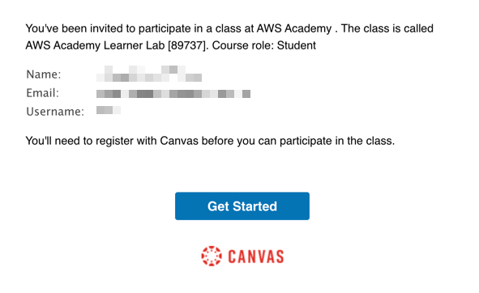
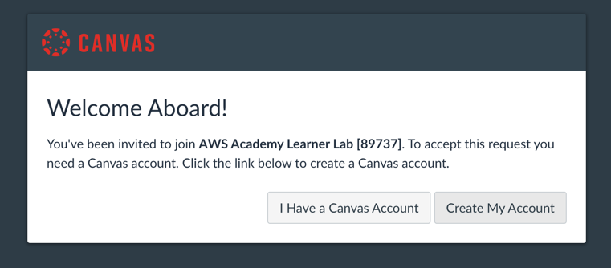
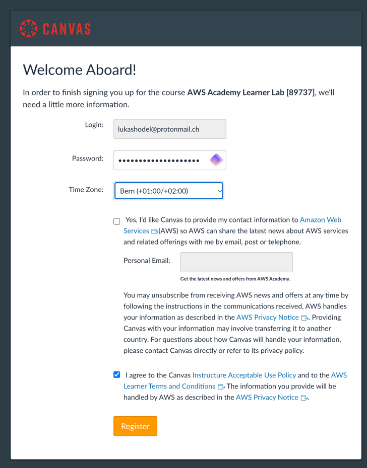
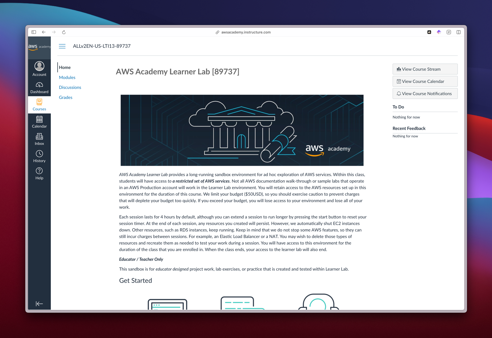
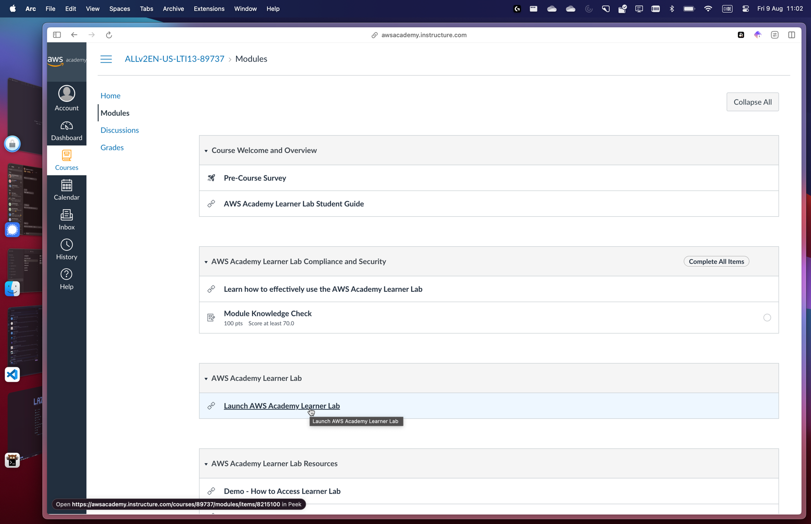
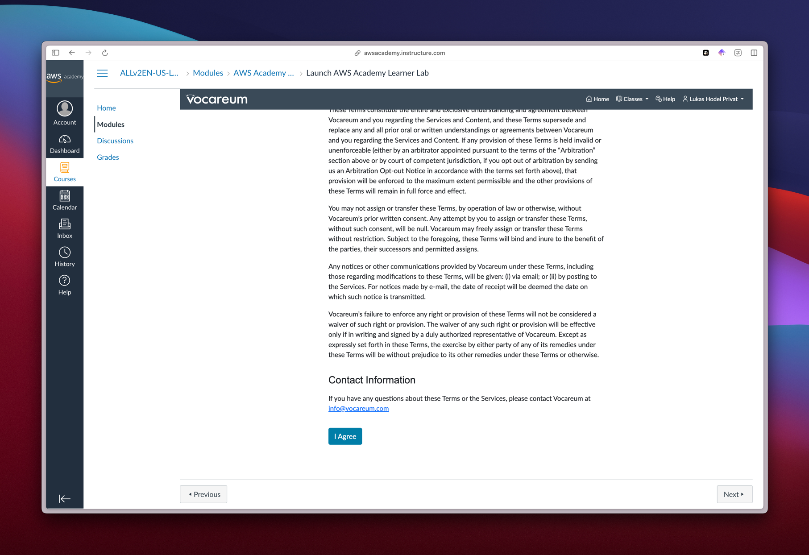
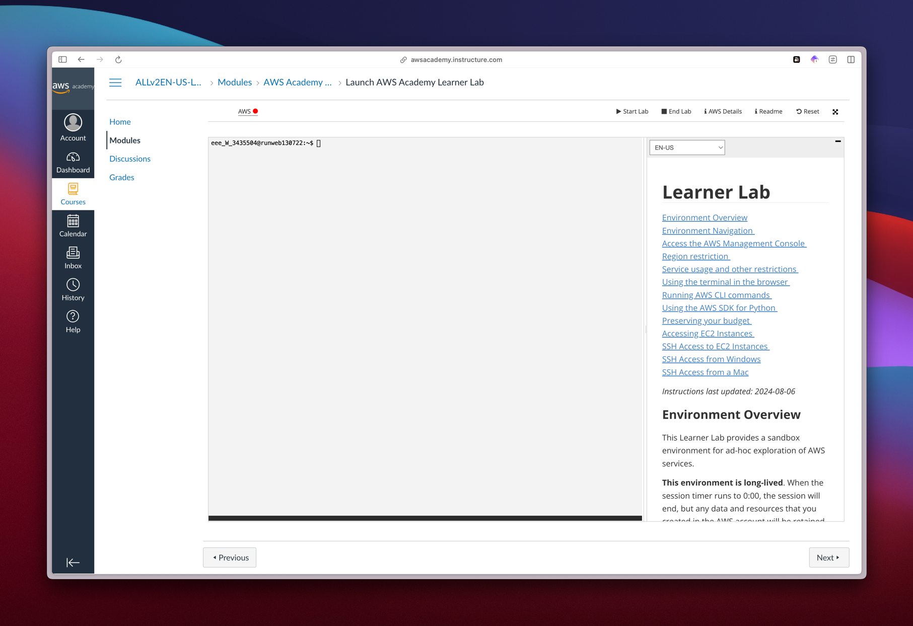
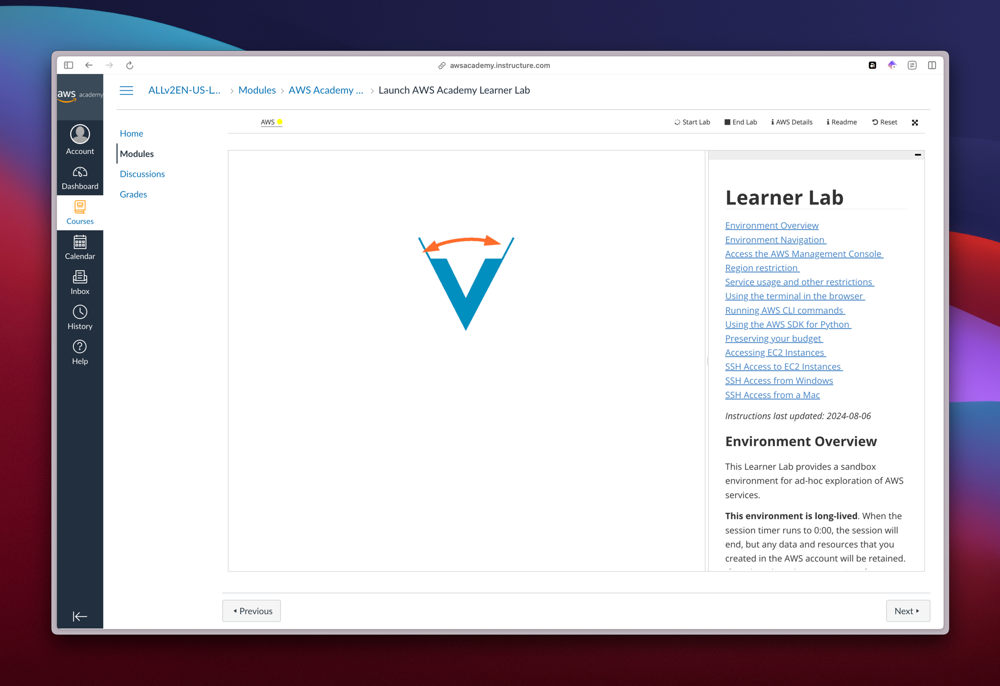
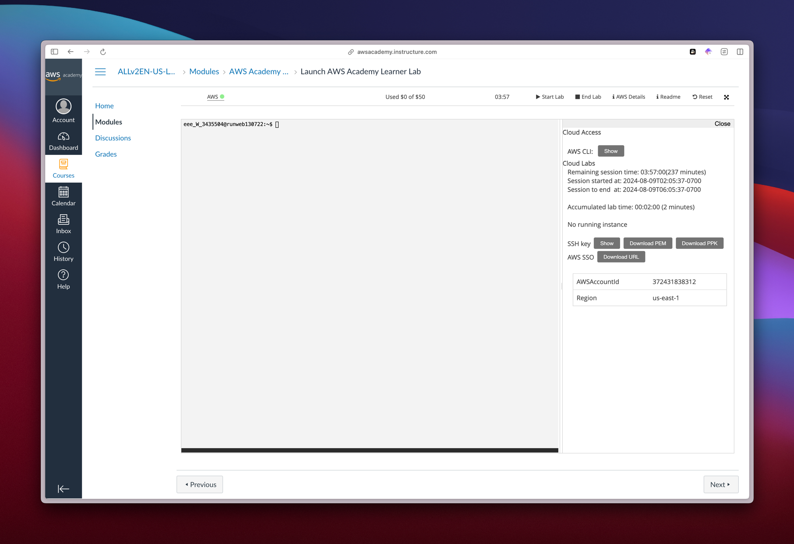

# AWS Academy Lerner Lab

In dem Modul werden Web-Applikationen über eine CI/CD-Pipeline direkt nach
[Amazon AWS](https://aws.amazon.com/de/) ausgeliefert (deployt). Dafür haben
alle eine Einladung per E-Mail erhalten. Bitte folgt dieser Anleitung, um das
AWS-Lerner-Lab zu starten.

## Aufgabe

### 1. Auf **"Get Started"** klicken

### 2. Auf **"Create My Account"** klicken

### 3. Formular ausfüllen

- Ein Passwort wählen
- Die **Zeitzone auf Bern** stellen
- AGB akzeptieren
- Mit **"Register"** abschicken

### 4. Academy - Home

Nach dem Registrieren solltet Ihr auf folgende Übersichtsseite gelangen. Diese
"Home"-Seite ist nicht relevant.

- Ihr könnt direkt zur Seite **"Modules"** navigieren.

  

### 5. Academy - Modules

- Unter "Modules" interessiert nur **"Launch AWS Academy Learner Lab"**
- Öffnet **"Launch AWS Academy Learner Lab"**

  

### 6. Launch Academy Learner Lab

- Als Erstes muss die AGB mit **"I Agree"** akzeptiert werden.

  

- Jetzt sollte folgende **Übersicht** zu sehen sein.

  

1. Link zur **AWS Management Console**.
   - Wenn **rot**, ist die Umgebung gestoppt, wenn **gelb**, ist die Umgebung am
     Starten.
   - Wenn **grün**, ist die Umgebung gestartet.
2. **Start Lab**: Startet die Umgebung.
3. **End Lab**: Stoppt die Umgebung, (macht nichts kaputt!)
4. **AWS Details**: Zeigt die Credentials und Account Informationen an
5. **Reset**: Setzt die Umgebung zurück (**löscht alles!** Braucht lange).
6. **Console**: AWS Academy Learner Lab Console. (wird von uns nicht gross
   verwendet)

### 7. Start Lab

- Starte jetzt die Umgebung mit **Start Lab**.
- Das "Lämpchen" wird nun gelb
  

### 8. AWS Details

- Ist das "Lämpchen" grün, ist die Umgebung gestartet.
- Über "AWS Details" können nun alle Informationen und Credentials angezeigt
  werden.
  
