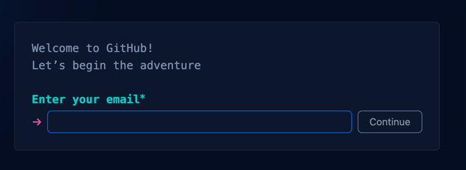

# GitHub Account erstellen

Das Modul baut auf GitHub auf. Daher ist es unerlässlich, dass jeder einen
GitHub Account besitzt.

## :pen: Aufgaben

- [x] [GitHub - Signup](https://github.com/signup) öffnen.
- [x] Einen Account mit der `ihr-name@bbzbl-it.ch` E-Mail-Adresse erstellen.

:::note

Ihr dürft auch euren persönlichen Account verwenden, diese muss der Lehrperson
schriftlich kommuniziert werden!

:::

### SSH Konfigurieren

:::info

Das muss **nicht in der ersten Stunde** gemacht werden. Um Zeit zu sparen ist
dieser Schritt erst nötig, wenn ein Repository lokal geklont wird.

:::

Um lokal nach GitHub Änderungen "pushen" zu können (`git push`), muss lokal
einen SSH key erstellt werden und dieser auf GitHub registriert werden.

Hier gibt es eine Anleitung von GitHub wie dies genau funktioniert.

- [GitHub SSH Dokumentation](https://docs.github.com/en/authentication/connecting-to-github-with-ssh/adding-a-new-ssh-key-to-your-github-account)
