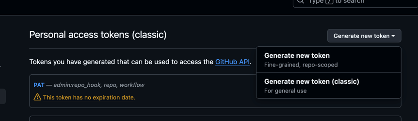
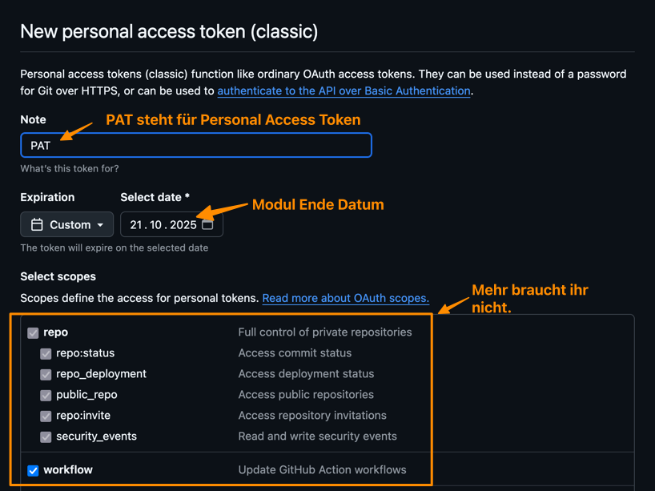
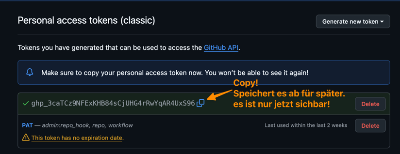

# GitHub Personal Access Token erstellen

Wir brauchen für einen spezifischen use-case später ein Personal Access Token.
Dies kann mit diesen Schritten erstellt werden.

1. In GitHub anmelden
2. Account -> Settings -> Developer Settings -> Personal access tokens -> Tokens
   (classic)
   - Wenn Angemeldet sollte
     [:link: **dieser Link die Settings öffnen**](https://github.com/settings/tokens).
3. **Generate new token classic** wählen
   
4. Confirm access mit Mail oder App
5. Einstellungen
   - Note: PAT
   - Expiration: Custom mit Modul-Enddatum + 1 Tag (z.B. 21.10.2025)
   - Scopes: repo und workflow
     
6. Generate 
7. Das Token wird [später im Modul](/docs/lektionen/woche01/aufgabe-nginx-example-klonen.md#personal-access-token-pat-als-secret-setzen) verwendet. Bitte lokal sicher aufbewahren. Am
   besten in einem Passwortmanager.

:::note What is it good for?

Wir werden in unserer CI-CD Pipeline auch automatisierte weitere Workflows
starten. Dies geht nur mit deinem Privaten Access Token.

- Da ihr ziemlich sicher individuell an den Punkt kommt, ist es gut haben schon
  mal alle das Token, damit ich nicht bei jedem einzeln vorbei schauen muss.

:::

## Quellen

- Dokumentation auf GitHub:
  [Managing your personal access tokens](https://docs.github.com/en/authentication/keeping-your-account-and-data-secure/managing-your-personal-access-tokens)
