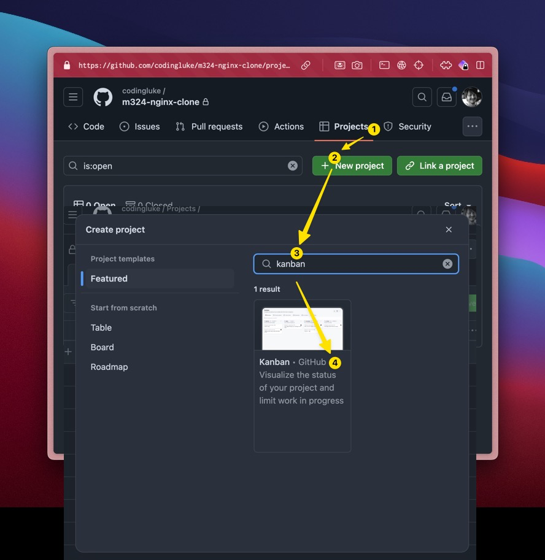
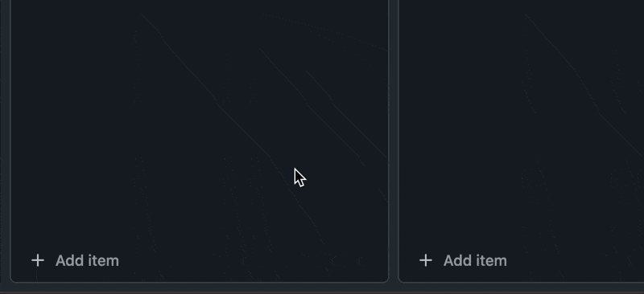
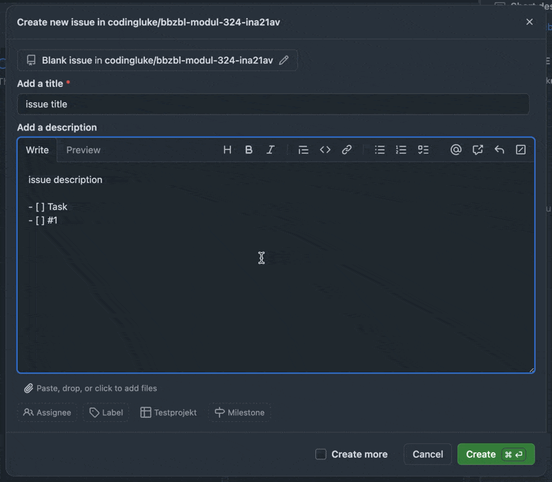
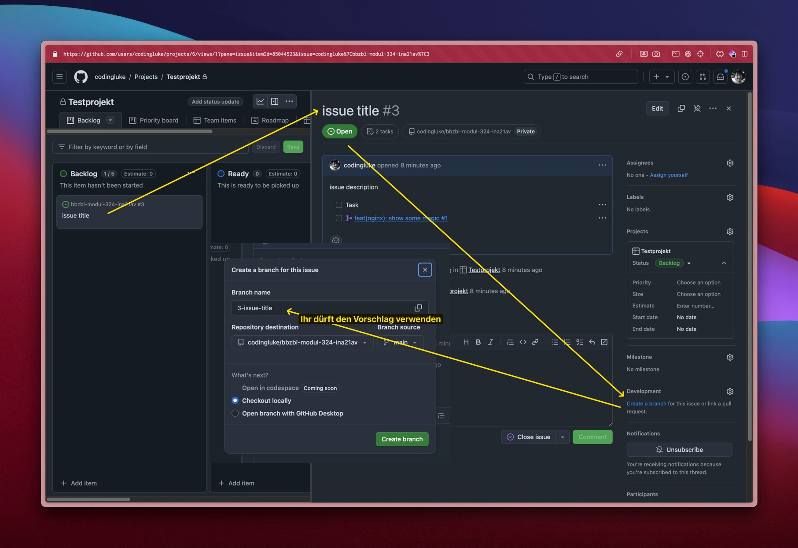
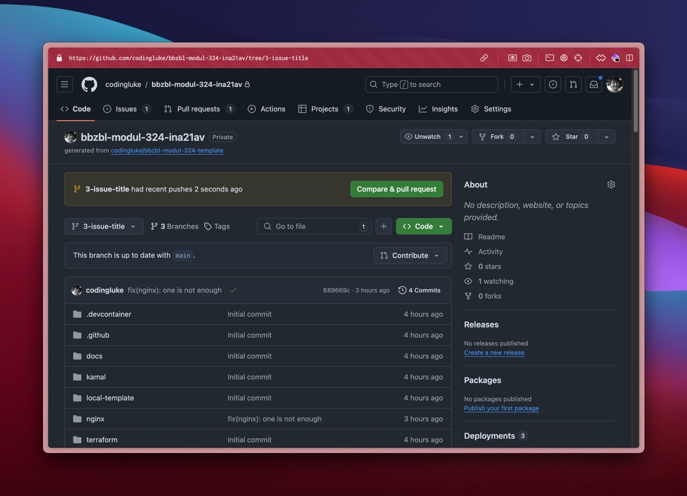
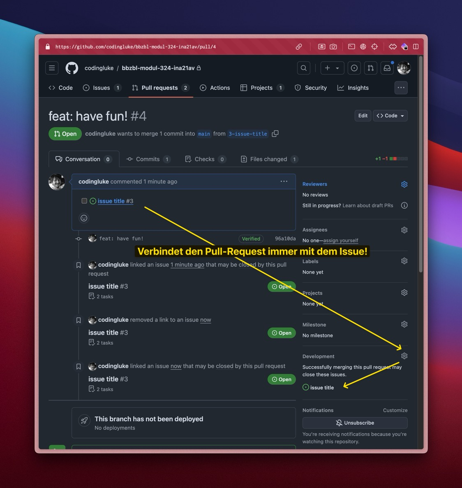

# GitHub Projekt erstellen

**:dart: Arbeitsgrundlage schaffen | :dna: Gruppenarbeit | :clock1: 20 Min |**

Das Projektmanagement fürs Projekt wird komplett in GitHub durch mehrere Issues
und einem GitHub Projekt realisiert.

:::note

Ein GitHub Projekt ist nicht auf ein Repository gebunden. Das kann zu Verwirrung
führen.

- Es gibt auch einen offiziellen Thread dafür
  [Projects Beta Support adding default repo for project](https://github.com/orgs/community/discussions/8251)

:::

## 📝 Auftrag

### Erstellt ein GitHub Projekt im Projekt Repository

[📜 GitHub Projekt](https://docs.github.com/en/issues/planning-and-tracking-with-projects/learning-about-projects/about-projects)


### Öffnet die **Project details** und fügt als Beschreibung einen Link zum Repository rein.

- :bulb: Dies ermöglicht das einfache Navigieren vom Projekt zum Repository

### Erstellt erste [📜 GitHub Issues](https://github.com/features/issues) und spielt damit

- mit `#` kann das Repository ausgewählt werden, in welchem der Issue erstellt
  werden soll (siehe gif)
- Wird einfach nur ein "Item" erstellt, ist es ein "draft" im Projekt und noch
  nicht an einen Issue gebunden.
  
- Verknüpfen, Taggen
- Erstellt Tasks in Markdown (dieser kann man toggeln)
  ```markdown
  - [ ] Task 1
  ```
- Erstellt Eine Referenz zu einem Issue (hier #1) in Markdown
  ```markdown
  - [ ] #1
  ```



### Erstellt einen Branch direkt aus dem Issue



:::tip

- Erstellt ihr die Branches auf diesem Weg, sind sie automatisch an den Issue
  geknüpft.
- Keine Angst es ist auf gleiche weise möglich einen Branch zu Verknüpfen

:::

### Erstellt einen Pull-Request vom Branch und linkt ihn zum Issue

- Öffnet den Branch im Repository
- Macht durch das GUI eine Änderung, am besten an der die Datei `README.md`
  - :exclamation: Dabei müsst ihr nicht nochmals einen Subbranch erstellen!



- Linkt den Issue zum Pull-Request!



:::danger Notenrelevant

Es wird Bewertet, dass alle Issues welche geschlossen sind einen Pull-Request
referenzieren.

- Ausnahmen: Issue welche keinen Code generieren, wie z.B. Mockubs erstellen.
- Die Ausnahmen müssen aber durch Akzeptanzkriterien beweisen, wieso der Issue
  "done" ist.
  - Link zu eine externen Resource, wie z.B. einem Google Ordner mit Bilder
  - Link zu erstellten Tickets resultiert von diesem
  - usw.

:::
