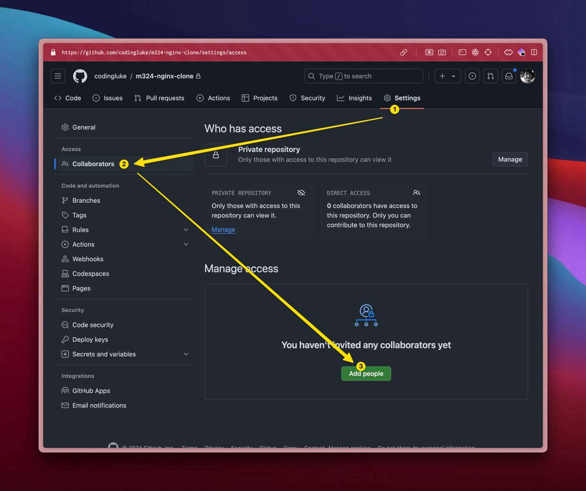

# GitHub Repo erstellen

**:dart: Arbeitsgrundlage schaffen | :dna: Gruppenarbeit | :clock1: 10 Min**

:::caution Im Projekt arbeitet Ihr alle im gleichen Repository!

:::

### 📝 Auftrag

1. Der **Teamleader erstellt** ein GitHub Repository
   - Verwendet dafür das Template
     [`modul-324-starter`](https://github.com/herrhodel/modul-324-starter)
   - Die AWS Credentials und PAT könnt Ihr später noch einfügen
2. Der **Teamleader** gibt allen Mitgliedern die **Berechtigungen**
   - Bitte auch der Lehrperson `@herrhodel`

