# Web-Applikation Template Repository

Das Modul verfolgt das Prinzip, **_make-it-work_, _then-make-it-yours_**. Dies
heisst es existiert ein funktionsfähiges, minimales Beispielprogramm. In diesem
Fall ist es ein einfachen [nginx](https://nginx.org/en/) Webserver, welcher über
ein GitHub Template Repository von jedem Lernenden geklont und dann individuell
angepasst wird.

:::tip Ziel

- Das Ziel vom Modul ist es, dass jeder mindestens diese Beispiel App verstanden
  hat 🥳

:::

## Aufgaben

### Das Template `bbzbl-modul-324-template` klonen

- In den GitHub Account einloggen
- [https://github.com/codingluke/bbzbl-modul-324-template](https://github.com/codingluke/bbzbl-modul-324-template)
  aufrufen
- "Use this Template" -> "Create a new repository" wählen
  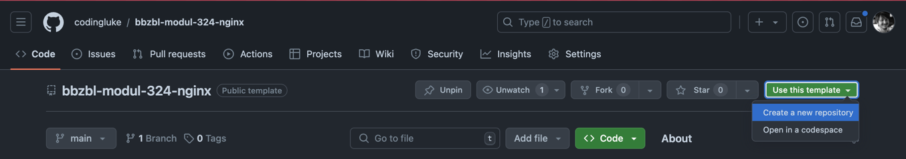
- Formular ausfüllen
  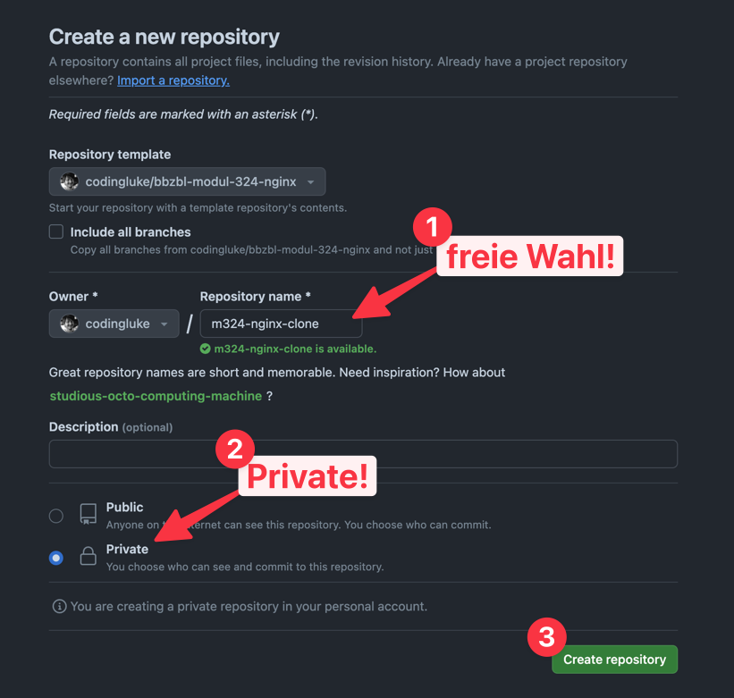
  - Der Name dürft Ihr selber wählen.
  - Bitte **"Private"** auswählen, später mir (codingluke) berechtigen
  - Mit **"Create Repository"** bestätigen

### AWS Credentials in Repository Environment Variablen übertragen

- Im neu erstellten Repository auf **"Settings" -> "Secrets and variables" ->
  "Actions"** navigieren
- Auf **"New Repository secret"** klicken
  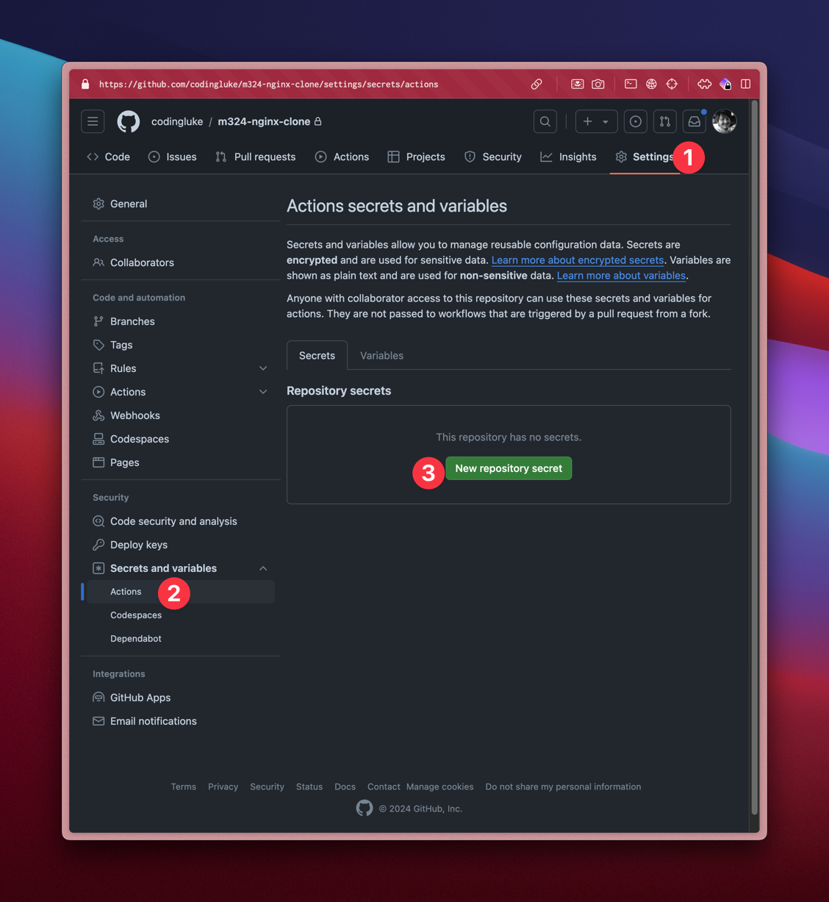
- Für alle Einträge unter **"AWS Details"** ein Secret erstellen, es sollten **5
  Secrets** existieren
  - AWS_ACCESS_KEY_ID
  - AWS_SECRET_ACCESS_KEY
  - AWS_SESSION_TOKEN
  - AWS_SSH_PRIVATE_KEY
    
  - AWS_ACCOUNT_ID
    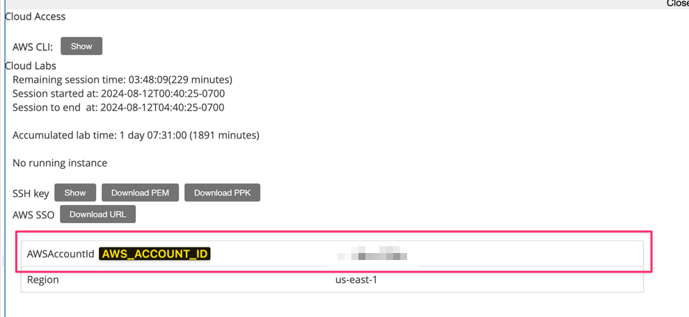

### Berechtigungen setzen

1. Im neu erstellten Repository auf **"Settings" -> "Actions" -> "General"**
   navigieren
2. Ganz nach unten scrollen
3. **"Allow GitHub Actions to create and approve pull requests"** erlauben

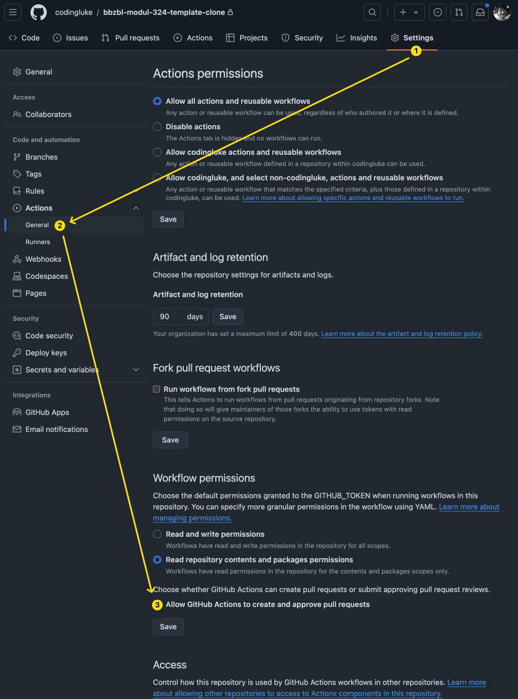

:::info

- Diese Berechtigung ist wichtig, dass automatisch Pull-Request erstellt werden
  können, was die Automatisierung von Releases ermöglicht.
- Mehr dazu nächste Woche.

:::

### Amazon AWS Infrastruktur aufsetzten

Es existiert eine GitHub Action
[Setup Infrastructure on Amazon AWS](https://github.com/codingluke/bbzbl-modul-324-template/blob/main/.github/workflows/aws-infrastructure.yml)

:::caution

- Diese kann manuell gestartet werden.
- Da die Action sich mit Amazon verbindet, müssen **zuerst die Credentials
  übertragen** sein.

:::

Danach die Action folgendermassen gestartet werden:

1. Nach **"Actions"** navigieren
2. **"Setup Infrastructure on Amazon AWS"** auswählen
3. **"Run workflow"** auswählen

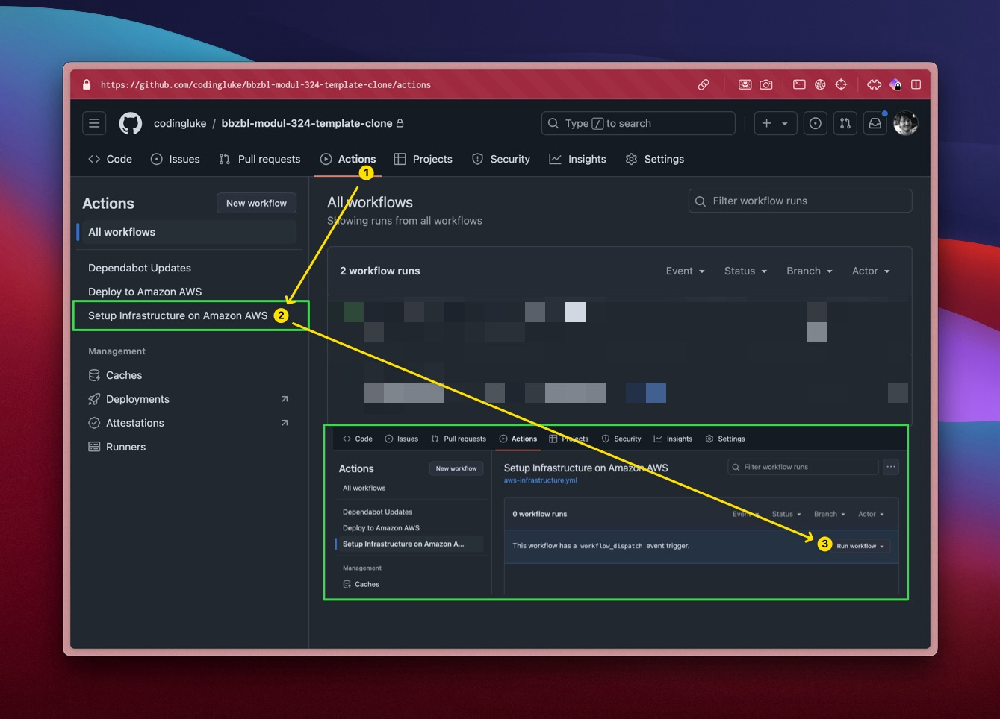

Nun wird ein Workflow mit zwei Steps gestartet:

- der Erste "Create AWS Resourcen" erstellt alle AWS Resourcen, d.H. die Ubuntu
  VM und co.
- der Zweite "Bootstrap Kamal on AWS EC2 instance" installiert die nötigen tools
  in der Ubuntu VM

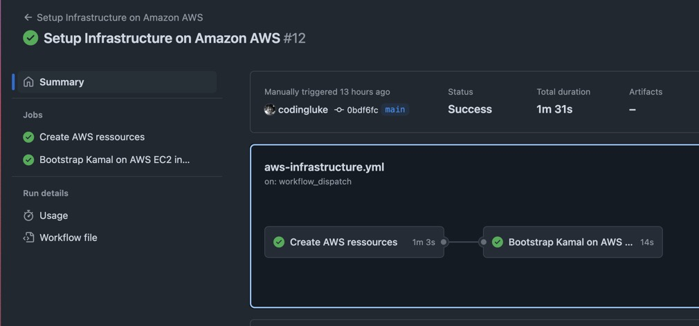

- Wenn alles grün ist (hoffentlich :sweat_smile:) sollte die Umgebung parat
  sein, dass Docker-Images deployed werden können.

### Nginx Image bauen und ausliefern (deployen)

Ist die AWS Umgebung aufgesetzt, kann die Action "Deploy to Amazon AWS" analog
gestartet werden.

1. **"Deploy to Amazon AWS"** auswählen
2. **"Run workflow"** auswählen

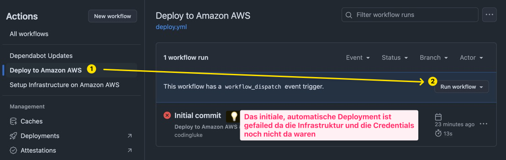

3. Warten bis das Deployment geklappt hat
4. Nun sollte einen Link "Visit me on http://public-ip :rocket:" sichtbar sein

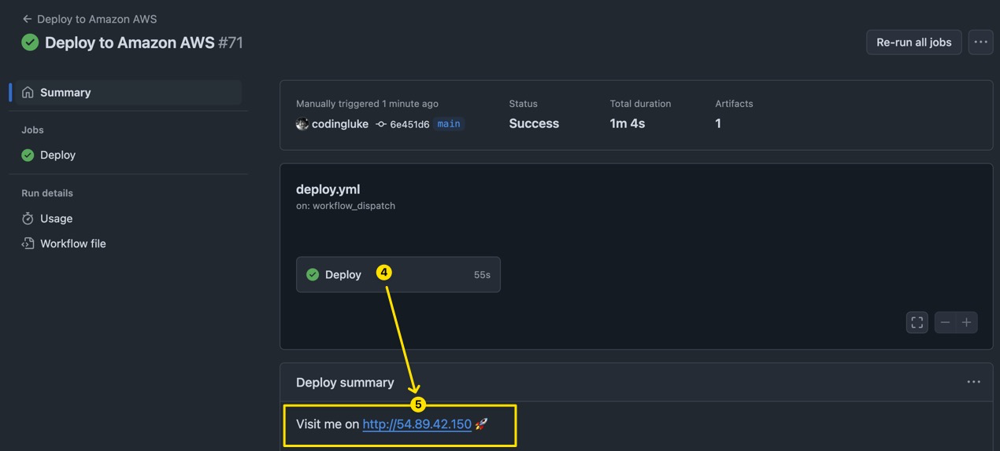

### Webseite in Browser öffnen

Nun ist die Web-App auf AWS ausgeliefert und öffentlich verfügbar.

:::caution HTTP ist unsicher...

- Es handelt sich um **http** und nicht https!
- Wenn euer Browser motzt, evt. Firefox verwenden.

:::

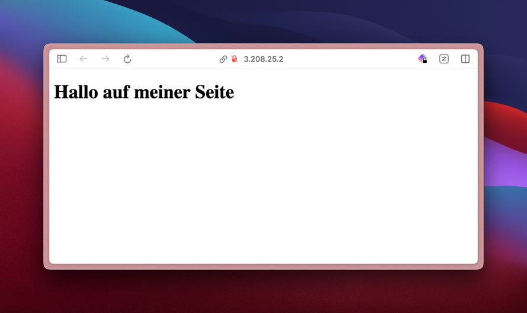

### HTML bearbeiten

Nun ist es möglich Änderungen an der App vorzunehmen, welche automatisch auf AWS
deployed werden!

- Navigiert zu **"Code -> nginx -> src -> index.html"** und klickt auf **"Edit"**
  <!-- 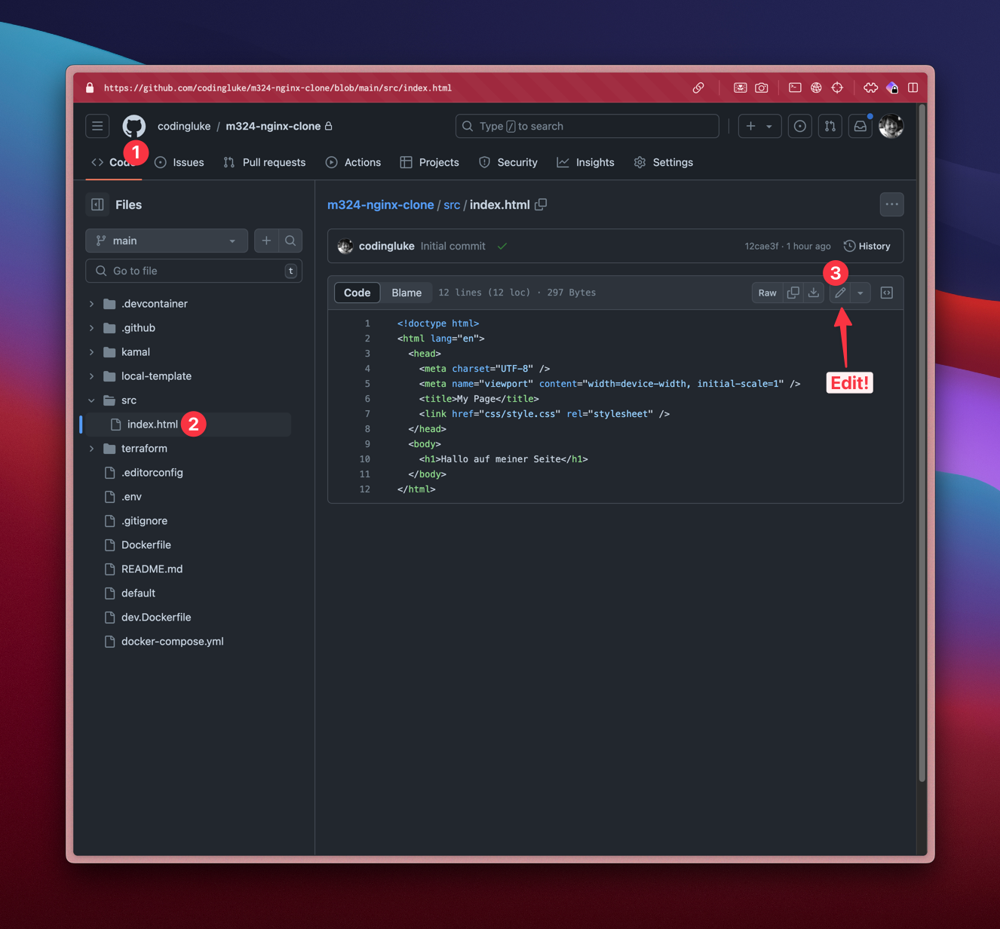 -->
  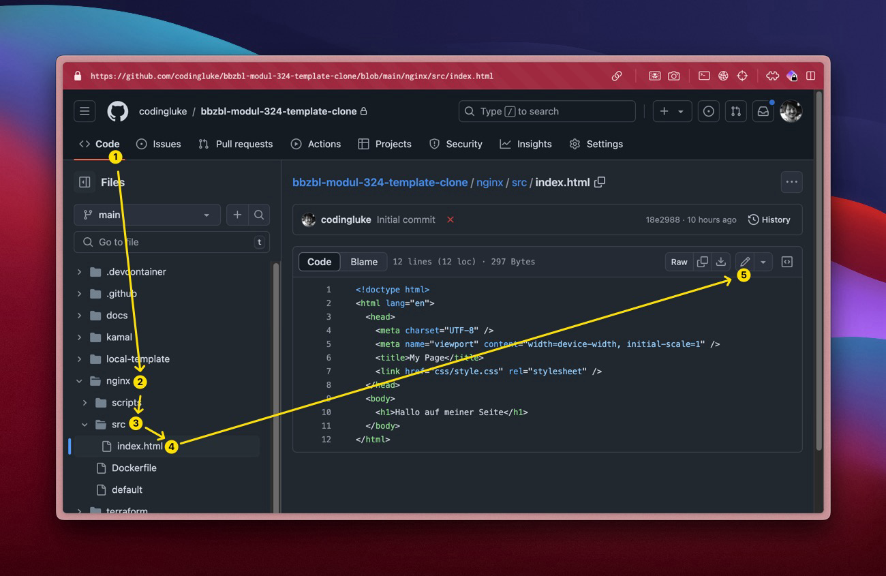
- Fügt folgenden Tag in den Body ein

  ```html
  
  ```

- **"Commit changes"**.

  :::caution

  - :boom: Verwendet bitte die Commit-Message `feat(nginx): show some magic`!

  :::

  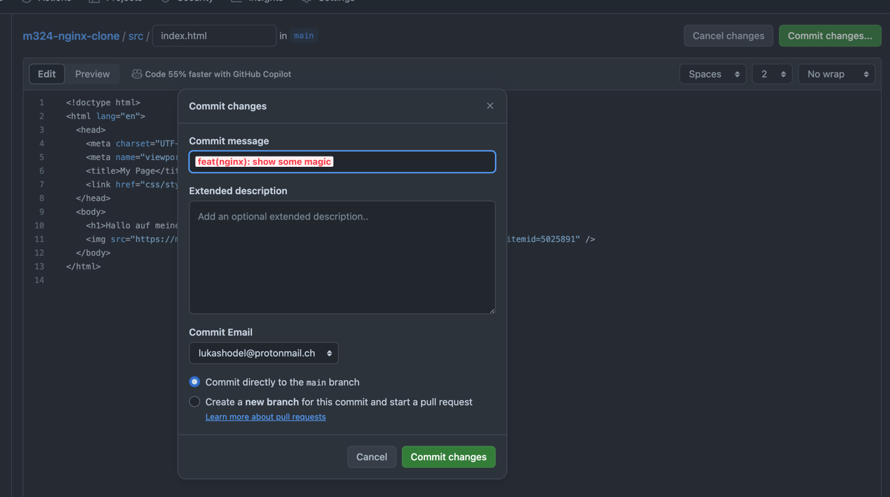

- Nun wird automatisch die GitHub Action **"Deploy to Amazon AWS"** gestartet.
- Warten bis die GitHub Action fertig ist
  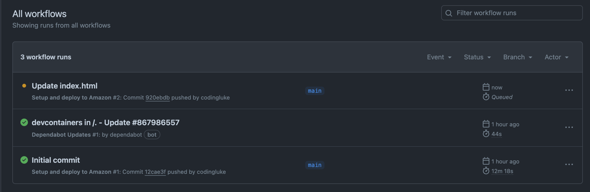

- **:boom: Nun die Webseite refreshen**
