# Web-Applikation Musterlösung

Das Modul verfolgt das Prinzip, **_make-it-work_, _then-make-it-yours_**. Dies
heisst es existiert ein funktionsfähiges, minimales Beispielprogramm. In diesem
Fall ist es ein einfachen [nginx](https://nginx.org/en/) Webserver, welcher über
ein GitHub Template Repository von jedem Lernenden geklont und dann individuell
angepasst wird.

:::tip[Ziel]

- 🎯 Das Ziel vom Modul ist es, dass jeder mindestens diese Beispiel-App
  verstanden hat.

:::

:::info

- Das Template wurde verschoben und umbenannt, die Screenshots noch korrekt,
  **konzentriert euch nicht auf die Namen** 😉
- In diesem Repository werdet ihr nicht arbeiten. **Es dient als Muster zum
  Nachschlagen**.
- Im Projekt started Ihr mit einem leeren Repository.

:::

## Aufgaben

### Das Template `modul-324-muster` klonen

- In den GitHub Account einloggen
- [https://github.com/herrhodel/modul-324-muster](https://github.com/herrhodel/modul-324-muster)
  aufrufen
- "Use this Template" -> "Create a new repository" wählen
  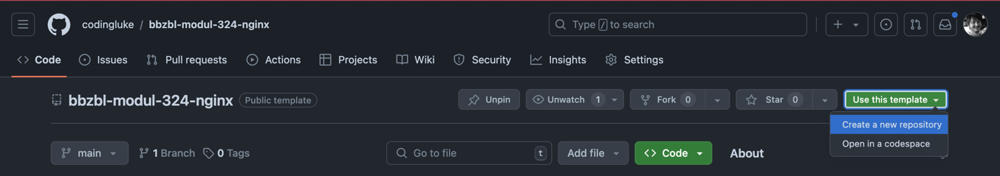
- Formular ausfüllen
  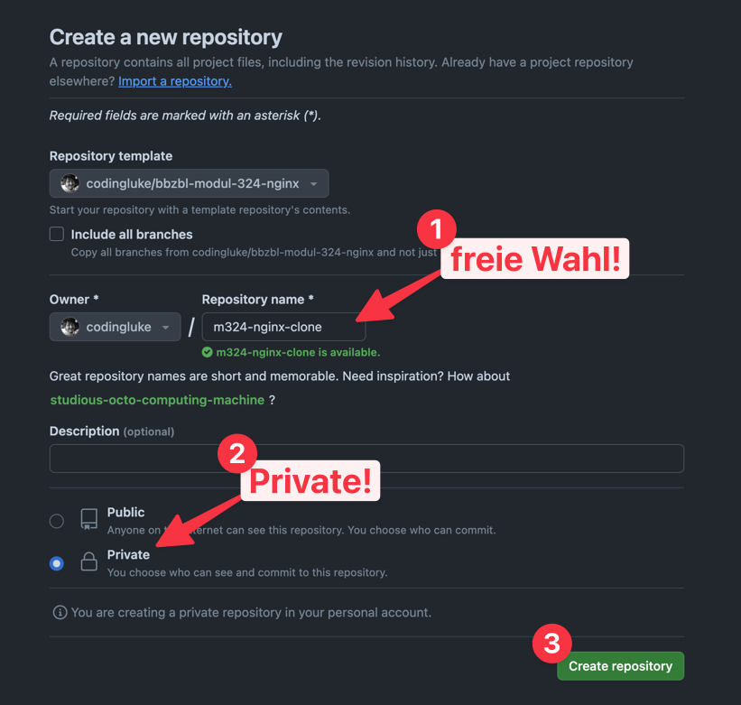
  - Der Name dürft Ihr selber wählen.
  - Bitte **"Private"** auswählen, später mich (@herrhodel) berechtigen
  - Mit **"Create Repository"** bestätigen

### AWS Credentials in Repository Environment Variablen übertragen

- Im neu erstellten Repository auf **"Settings" -> "Secrets and variables" ->
  "Actions"** navigieren
- Auf **"New Repository secret"** klicken
  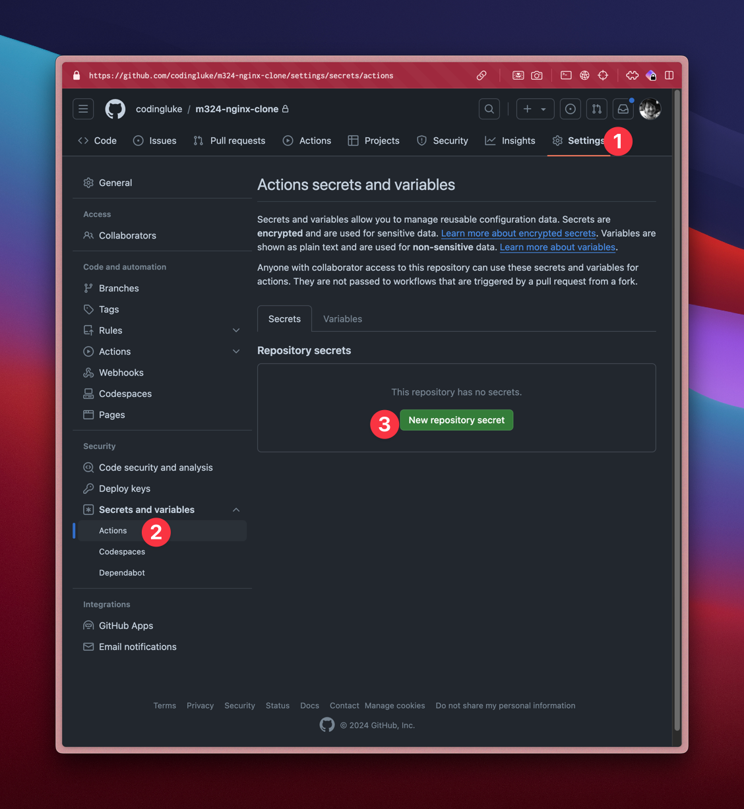
- Für alle Einträge unter **"AWS Details"** ein Secret erstellen, es sollten **3
  Secrets** existieren
  - AWS_CREDENTIALS
  - AWS_SSH_PRIVATE_KEY
  - AWS_ACCOUNT_ID 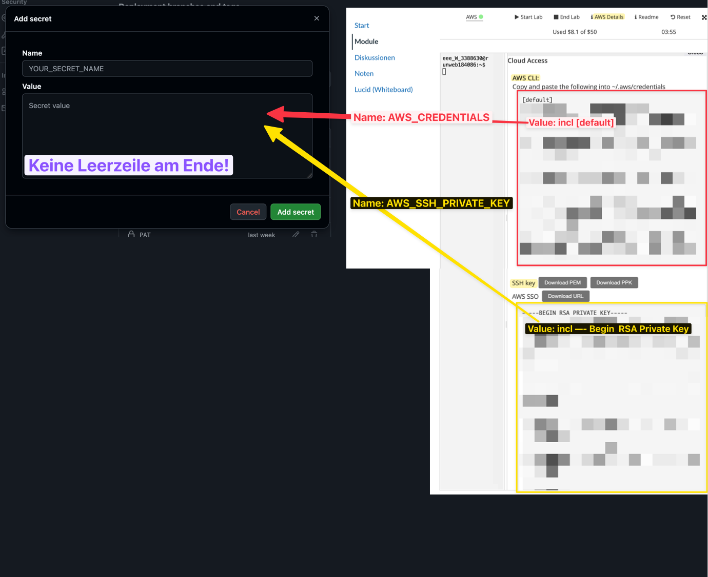
    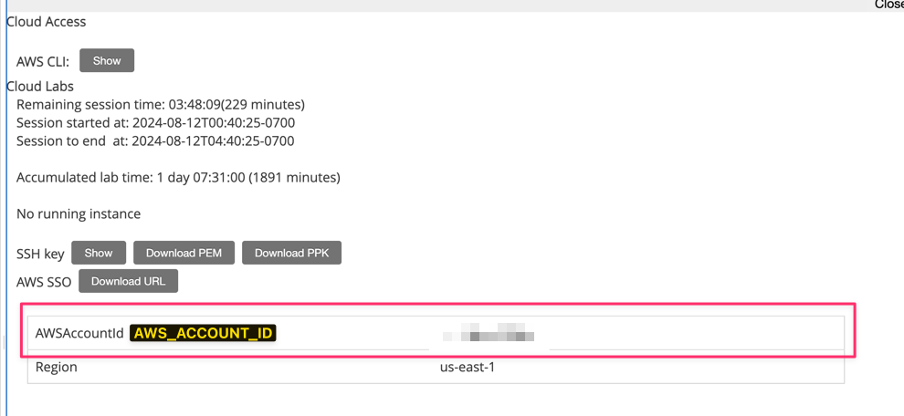

### Personal Access Token (PAT) als Secret setzen.

- Auf **"New Repository secret"** klicken
- Name: PAT
- Value: Das gespeicherte PAT der
  [Aufgabe GitHub PAT erstellen](./aufgabe-github-pat-erstellen.md) einfügen

:::note[Es sollten nun 4 Secrets bestehen:]

**AWS_CREDENTIALS, AWS_SSH_PRIVATE_KEY, AWS_ACCOUNT_ID, PAT**

:::

### Berechtigungen setzen

1. Im neu erstellten Repository auf **"Settings" -> "Actions" -> "General"**
   navigieren
2. Ganz nach unten scrollen
3. **"Allow GitHub Actions to create and approve pull requests"** erlauben

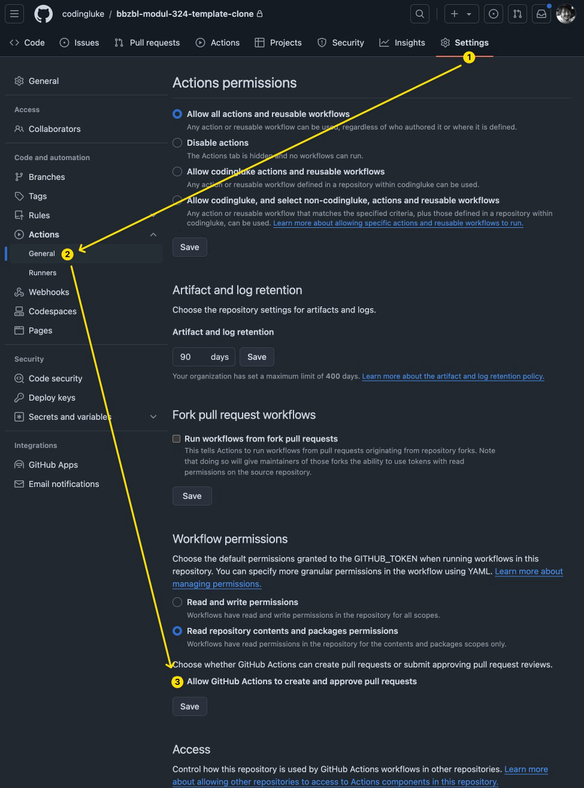

:::info

- Diese Berechtigung ist wichtig, dass automatisch Pull-Request erstellt werden
  können, was die Automatisierung von Releases ermöglicht.
- Mehr dazu nächste Woche.

:::

### Amazon AWS Infrastruktur aufsetzten

Es existiert eine GitHub Action
[Setup Infrastructure on Amazon AWS](https://github.com/codingluke/bbzbl-modul-324-template/blob/main/.github/workflows/aws-infrastructure.yml)

:::caution

- Diese kann manuell gestartet werden.
- Da die Action sich mit Amazon verbindet, müssen **zuerst die Credentials
  übertragen** sein.

:::

Danach die Action folgendermassen gestartet werden:

1. Nach **"Actions"** navigieren
2. **"Setup Infrastructure on Amazon AWS"** auswählen
3. **"Run workflow"** auswählen

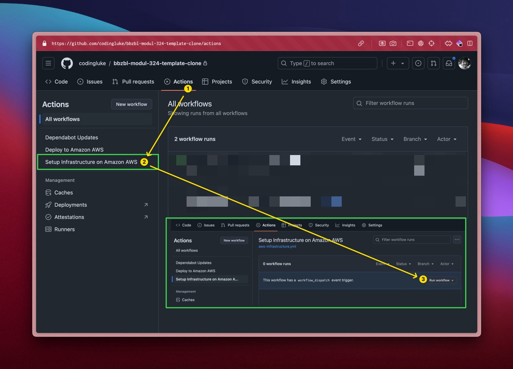

Nun wird ein Workflow mit zwei Steps gestartet:

- der Erste "Create AWS Resourcen" erstellt alle AWS Resourcen, d.H. die Ubuntu
  VM und co.
- der Zweite "Bootstrap Kamal on AWS EC2 instance" installiert die nötigen tools
  in der Ubuntu VM

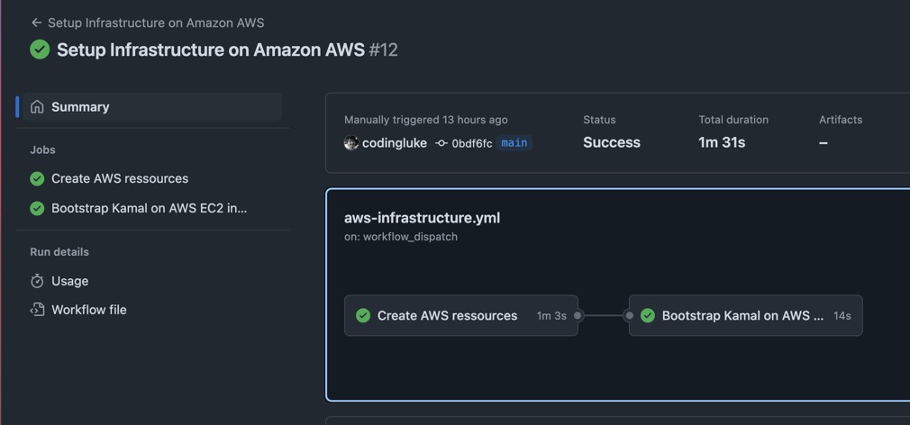

- Wenn alles grün ist (hoffentlich :sweat_smile:) sollte die Umgebung parat
  sein, sodass Docker-Images deployt werden können.

### Nginx Image bauen und ausliefern (deployen)

Ist die AWS Umgebung aufgesetzt, kann die Action "Deploy to Amazon AWS" analog
gestartet werden.

1. **"Deploy to Amazon AWS"** auswählen
2. **"Run workflow"** auswählen

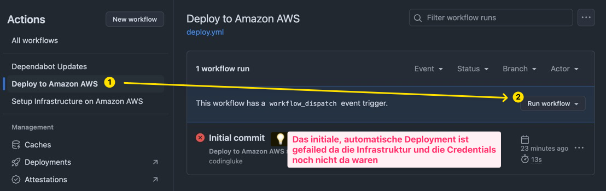

3. Warten bis das Deployment geklappt hat
4. Nun sollte einen Link "Visit me on http://public-ip :rocket:" sichtbar sein

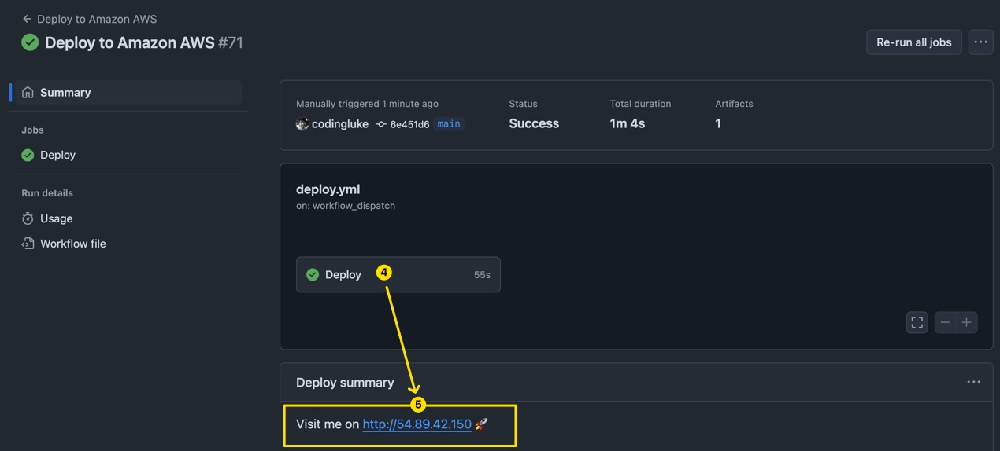

### Webseite in Browser öffnen

Nun ist die Web-App auf AWS ausgeliefert und öffentlich verfügbar.

:::caution[HTTP ist unsicher...]

- Es handelt sich um **http** und nicht https!
- Wenn euer Browser motzt, evt. Firefox verwenden.

:::

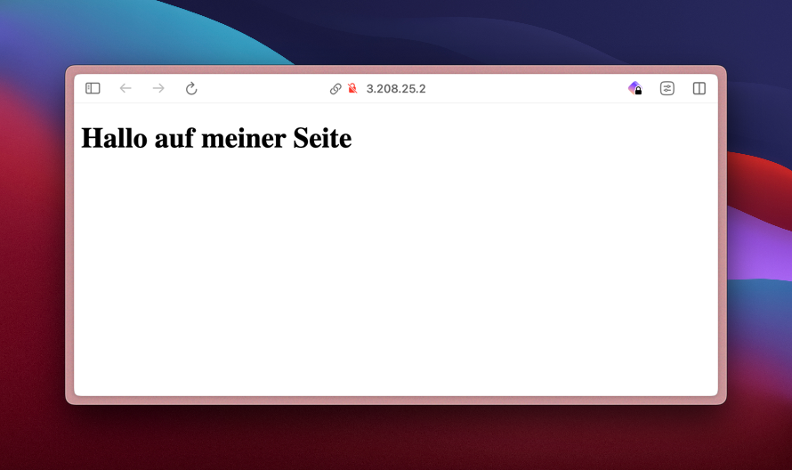

### HTML bearbeiten

Nun ist es möglich Änderungen an der App vorzunehmen, welche automatisch auf AWS
deployed werden!

- Navigiert zu **"Code → app → src → index.html"** und klickt auf **"Edit"**
  {/* 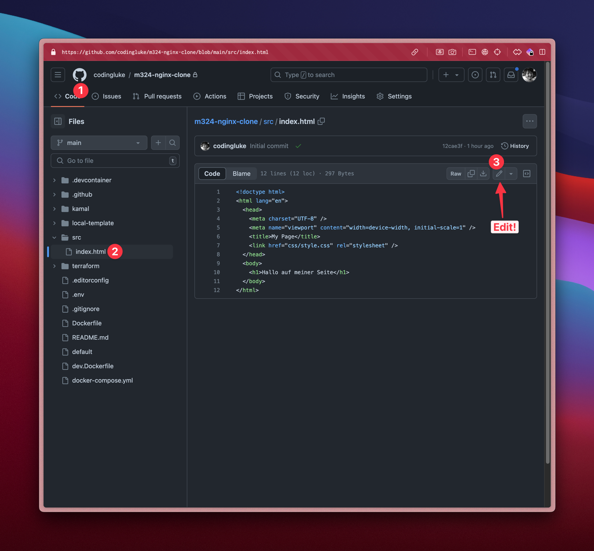 */}
  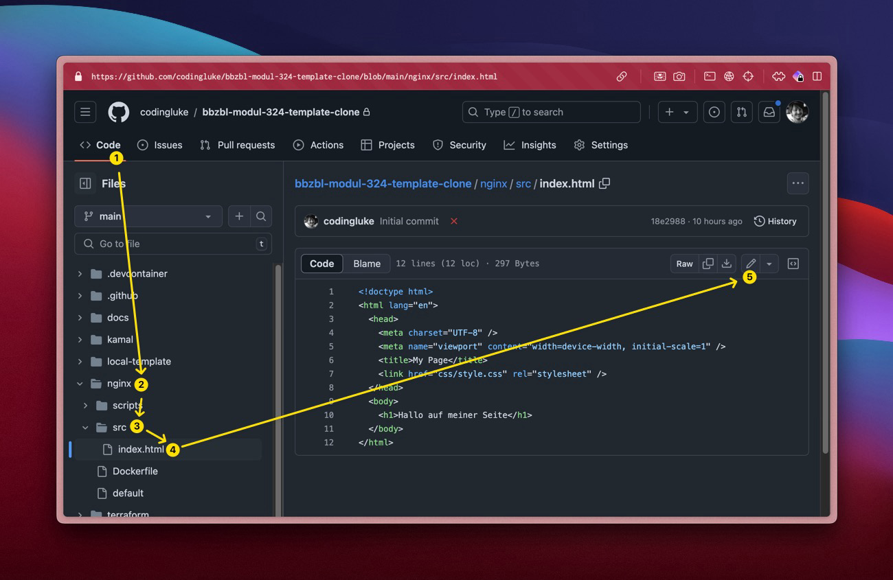.
- Fügt folgenden Tag in den Body ein

  ```html
  
  ```

- **"Commit changes"**.

  :::caution

  - :boom: Verwendet bitte die Commit-Message `feat(nginx): show some magic`!
  - :boom: Create a new branch for this commit and start a pull request

  :::

  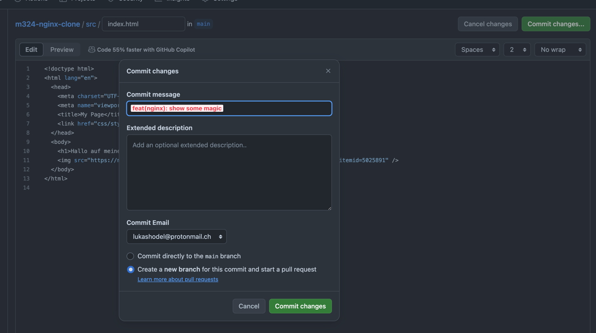

- In einem Pull-Request, könnte man den Code-Change kommentieren.
- Nach dem mergen wird automatisch die GitHub Action **"Deploy to Amazon AWS"**
  gestartet.
- Warten bis die GitHub Action fertig ist
  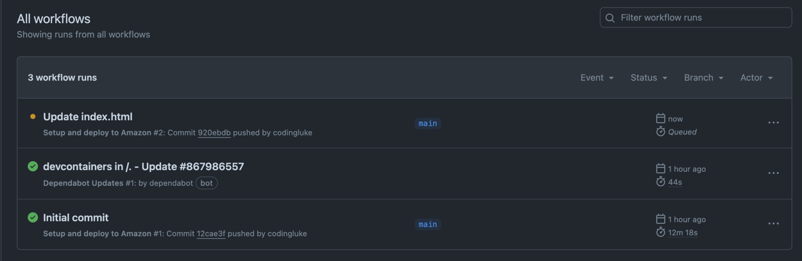

- **💥 Jetzt die Webseite aktualisieren**
