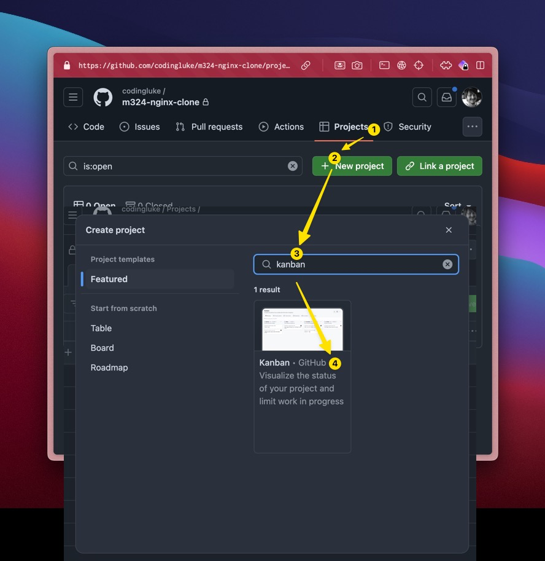

# GitHub Projekt erstellen

**:dart: Arbeitsgrundlage schaffen | :dna: Gruppenarbeit | :clock1: 20 Min |**

## 📝 Auftrag

1. Im erstellten Repository ein
   [📜 GitHub Projekt](https://docs.github.com/en/issues/planning-and-tracking-with-projects/learning-about-projects/about-projects)
   erstellen.



2. Erste [test-Issues](https://github.com/features/issues) erstellen und damit
   spielen

   - Verknüpfen, Taggen
   - Erstellt Tasks in Markdown (dieser kann man toggeln)
     ```markdown
     - [ ] Task 1
     ```
   - Erstellt Eine Referenz zu einem Issue (hier #1) in Markdown
     ```markdown
     - [ ] #1
     ```

:::tip Schliesst die test-issues, nicht löschen! Sie dienen als Doku.

:::
