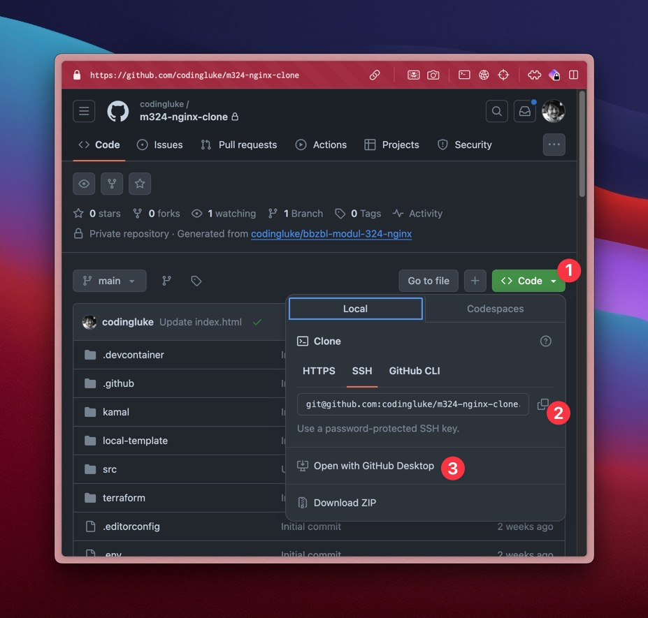
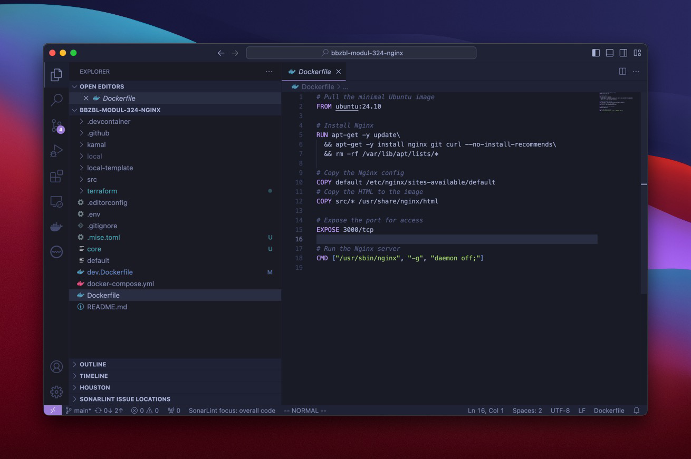

# Repository lokal klonen

Nachdem Ihr eine `ssh-key` generiert und in GitHub hinterlegt habt, sollte es
möglich sein euer Repository lokal zu klonen.

<div className="grid"><div>

1. Unter Code Das grüne Dropdown `<> Code` öffnen
2. Die **SSH Url** kopieren
3. oder Sofern [GitHub Desktop](https://desktop.github.com/download/)
   installiert wurde **Open with GitHub Desktop** wählen.

</div><div>



</div></div>

## In Bash klonen

Danach könnt ihr lokal folgender `git` Befehl ausführen.

```bash
git clone {kopierte-ssh-url-zum-repo}
```

:::tip ich würde es so machen, dann lernt ihr gerade die git Befehle.

:::

### In VS Code öffnen

<div className="grid"><div>

1. `File -> Open folder`
2. Das frisch geklonte repository auswählen
3. Es sollte ungefähr wie rechts aussehen

</div><div>



</div></div>

## Direkt in VS Code klonen

Alternativ könnt Ihr auch in VS Code das Repository klonen.

- [How to Clone a Github Repository with VS Code (Example)](https://www.jcchouinard.com/git-clone-github-repository-vscode/)

In Kürze:

- Die Kommando-Pallete öffnen mit `Ctrl+Shift+P` (Windows) oder
  `Command+Shift+P` (mac).
- Nach **"Git: clone"** suchen
- Bestätigen, die kopierte ssh-URL einfügen und dem Wizzard folgen.
