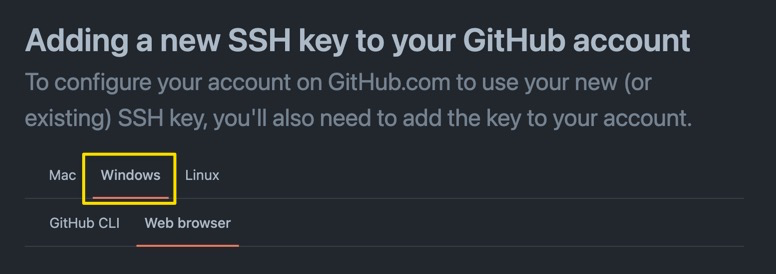

# SSH Key einrichten

Um ein eigenes Git-Repository von GitHub lokal zu klonen muss man sich
authentifizieren. Grundsätzlich gibt es zwei Arten um auf ein Repository
zuzugreifen, https und ssh. Da https bei jedem `git pull` und `git push` den
Benutzer und das Passwort abfragt, empfehle ich jedem das Repository via `ssh`
zu klonen. Damit kann man ohne user und passwort arbeiten. Man benötigt jedoch
einen `ssh-key` den man auf GitHub registrieren muss.

## Aufgabe

Bitte folgt den unten stehenden Anleitungen von GitHub um einen `ssh-key` zu
erstellen und auf GitHub zu registrieren.

- [Adding a new SSH key to your GitHub account](https://docs.github.com/en/authentication/connecting-to-github-with-ssh/adding-a-new-ssh-key-to-your-github-account)

Alle die bereits einen Key haben können direkt hier fortfahren

- [Adding a new SSH key to your account](https://docs.github.com/en/authentication/connecting-to-github-with-ssh/adding-a-new-ssh-key-to-your-github-account#adding-a-new-ssh-key-to-your-account)

:::tip Es gibt einen Windows Tab auf den Webseiten 😉

:::
