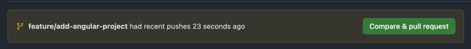

# Eigene Applikation aufsetzen

Das Fundament, damit Ihr alle zusammen arbeiten könnt, ist das Aufsetzen, oder
"Bootstrappen", der eigenen Applikation. Unten sind für einige gängigen
Technologien Beispiele vorhanden. Wählt einfach das aus, dass am besten zu eurem
Projekt passt.

- :dart: Eine `hello-world` App in der gewählten Technologie ist vorhanden
- :dart: Alle Teammitglieder haben diese lokal gestartet
- :dart: Die Grundlage ist gelegt, dass Tickets von allen Teammitglieder
  bearbeitet werden können.

:::tip Setzt als erstes das Frontend um!

- 📣 **Full-Stack mit Backend und DB ist zu Zeitaufwändig für dieses Modul.**

:::

<details>
<summary>:tv: Video!</summary>

<YouTube id="4IzeMwVlf7A"></YouTube>

<br/>
:::info bei den Installiervorgängen ruhig vorspulen ;)

:::

</details>

## Angular

Da erfahrungsgemäss viele Angular verwenden habe besteht dafür ein Beispiel. Ihr
dürft jedoch **[jede beliebige Technologie](#eine-eigene-technologie)**
verwenden.

- [Installationsanleitung von Angular](https://angular.dev/installation#setup-a-new-project-locally)

### neuen Branch erstellen

```bash
git checkout -b feature/add-angular-project
```

### @angular/cli im Devcontainer installieren

Angular braucht das Paket `@angular/cli`, damit der `ng` Befehl verfügbar ist.
Um diese für alle zur Verfügung zu stellen, sollte sie direkt im
`.devcontainer/Dockerfile` installiert werden.

- öffnet dazu `.devcontainer/Dockerfile`
- und erweitert den Node Install Befehl folgendermassen

```dockerfile
RUN mise use node@lts -g \
  && mise x -- npm install @angular/cli -g
```

- nun sollte der Befehl `ng` von Angular global im Devcontainer verfügbar sein.

### Ein Angular Projekt erstellen

- Öffne das Projekt im Devcontainer mit **"Reopen in Container"**
- Versichert euch, dass Ihr euch im Ordner `/workspace` befindet (`pwd`)
- Erstellt ein neues Angular Projekt mit folgendem Befehl und befolgt die
  Anleitung.

```bash
ng new <euer-projekt-name>
```

- wechselt in den neuen Projektordner mit `cd <euer-projekt-name>`

:::caution WICHTG

- öffnet die Datei `package.json` und sucht nach `ng serve`
  - Ersetzt den Befehl mit **`ng serve --host 0.0.0.0`**
  - :bulb: Dies ist nötig, sonst geht das Port-Forwarding zum Host nicht
    richtig. _(hat mich 1h gekostet)_

:::

- Startet den Server mit `npm start`
- Nun erscheint eine Meldung von VS Code dass ein Prozess auf dem Port 4200
  gestartet ist.
- Öffnet **http://localhost:4200** im Browser, :tada:

### Commiten, pushen und einen PR erstellen

Wenn die Angular App erstellt wurde, sollte der Stand, ohne grosse Änderungen
**commited werden**:

- Verwendet dafür eine
  [**Conventional-Commit**](https://www.conventionalcommits.org/en/v1.0.0/)
  Nachricht vom type **`feat`**
- Schaut dass ihr am eine der Nachricht mit (#issueId) den Issue verlinkt!
  - :boom: Natürlich ist `#iissueId` am Ende eine Nummer! Genau, die vom Issue
    wie z.B. `#1`

```bash
git add . # alle Dateien hinzufügen
git commit -m "feat: was auch immer (#issueId)" # Commiten und Issue verlinken
```

:::tip kleine commits

- Es ist besser mehrere kleine commits zu machen.
- Dies ist auch einfacher zum reviewen.
- Es dürfen mehrere commits auf einen Issue zeigen

:::

Nun könnt Ihr den **Branch nach GitHub pushen**:

```bash
git push origin feature/add-angular-project # Pushen
```

:::info Natürlich dürft Ihr auch ein GUI verwenden

:::

Auf GitHub müsst Ihr nun einen Pull-Request erstellen und diesen vom Team
reviewen lassen.


/Users/lhodel/Projects/bbzbl/bbzbl-modul-324/docs/lektionen/woche05/images/github-pull-request.png

### Von allen Teammitglieder lokal testen lassen

Ist der Pull-Request in `main` gemerged, sollen alle Teammitglieder:

1. Den `main` Branch auschecken

```bash
git checkout main
```

2. Den `main` Branch von GitHub pullen

```bash
git pull origin main
```

3. Den Devcontainer in VS Code starten
4. Im Devcontainer in den Ordner der App wechseln `

```bash
cd euer-projekt-name
```

5. Die App starten `npm start` (oder ein alternativ Befehl der gewählten
   Technologie)
6. Beim VS Code Popup, das **Port-Forwarding freigeben**!

## Eine eigene Technologie?

Ihr dürft das Projekt in jeder Beliebigen Technologie erstellen.

:::danger Einzige Bedingung

- **Alle Teammitglieder müssen mit der Technologie vertraut sein!**

:::

### Eine kleine Anleitung was dabei zu beachten ist:

1. Die Programmiersprache sollte per `mise use` direkt im `Dockerfile`
   installiert werden
2. Sofern weitere global installierte Pakete benötigt werden, müssen die mit
   `mise x -- <install befehl>` im `Dockerfile` installiert werden.
   - Bei Angular ist das z.B. `mise x -- npm i @angular/cli -g`

:::tip npx geht direkt!

- [Nextjs installiert](https://nextjs.org/docs/app/getting-started/installation#automatic-installation)
  man z.B. durch `npx create-next-app@latest` dafür muss kein globales Paket
  installiert werden.

:::

4. Das Projekt muss sich in einem eigenen Ordner befinden. z.B. `/coole-app`.
5. Das `Dockerfile` muss noch nicht angepasst werden. Dies machen wir später.
6. [Commiten, pushen und einen PR erstellen](#commiten-pushen-und-einen-pr-erstellen)
7. [Von allen Teammitglieder lokal testen lassen](#von-allen-teammitglieder-lokal-testen-lassen)
