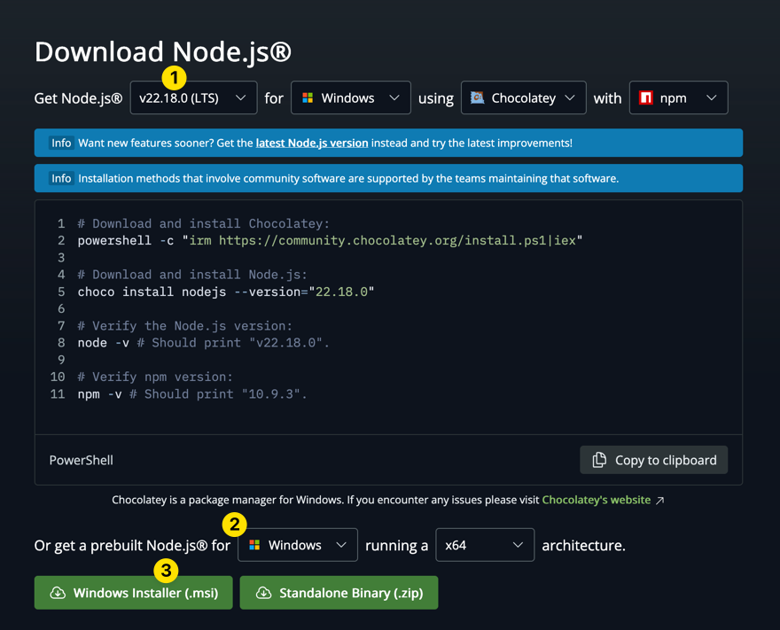

# Eigene Applikation aufsetzen

Das Fundament, damit Ihr alle zusammen arbeiten könnt, ist das Aufsetzen, oder
"Bootstrappen", der eigenen Applikation. Unten sind für einige gängigen
Technologien Beispiele vorhanden. Wählt einfach das aus, dass am besten zu eurem
Projekt passt.

- :dart: Eine `hello-world` App in der gewählten Technologie ist vorhanden
- :dart: Alle Teammitglieder haben diese lokal gestartet
- :dart: Die Grundlage ist gelegt, dass Tickets von allen Teammitgliedern
  bearbeitet werden können.

:::tip Setzt als Erstes das Frontend um!

- 📣 **Full-Stack mit Backend und DB ist zu Zeitaufwändig für dieses Modul.**

:::

<details>
<summary>:tv: Video!</summary>

<YouTube id="4IzeMwVlf7A"></YouTube>

<br/>
:::info bei den Installiervorgängen ruhig vorspulen ;)

:::

</details>

## Angular

Da erfahrungsgemäss viele Angular verwenden habe besteht dafür ein Beispiel. Ihr
dürft jedoch **[jede beliebige Technologie](#eine-eigene-technologie)**
verwenden.

- [Installationsanleitung von Angular](https://angular.dev/installation#setup-a-new-project-locally)

### neuen Branch erstellen

```bash
git checkout -b feature/add-angular-project
```

### NodeJs installieren

Sofern noch kein NodeJs auf dem Rechner installiert ist, muss dies nun
nachgeholt werden.

:::note

- Wenn ihr bereits einen eigenen Weg kennt nodejs zu installieren, benutzt den.
- Schaut, dass Ihr lokal **alle mit der gleichen NodeJs Version** arbeitet!
- Wenn die Gruppe sich mit `devcontainer` auskennt,
  [schaut euch den Zusatz](./optional/aufgabe-devcontainer.md) an. Es ist jedoch
  auf eigene Gefahr. Aus Erfahrung ist die Zeit im Modul knapp.

:::

#### Mac / Linux

Wenn ihr einen Mac oder Linux Rechner habt, empfehle ich
[`mise`](https://mise.jdx.dev/installing-mise.html) um Versionen zu
installieren.

- https://mise.jdx.dev/installing-mise.html

```bash
mise use nodejs@22.18.0
```

#### Windows

Installiert am besten nodejs mit dem "Windows Installer (.msi)". Sofern Ihr
Windows Paketmanagers wie ["chocolatey"](https://chocolatey.org/) kennt,
verwendet den.

- https://nodejs.org/en/download



### @angular/cli installieren

Angular braucht das node Paket `@angular/cli`, damit der `ng` Befehl verfügbar
ist. Die Person die Angular "Bootstrapt", also aufsetzt, muss den Befehl `ng`
global verfügbar haben.

```bash
npm install @angular/cli -g
```

### Ein Angular Projekt erstellen

Erstellt ein neues Angular Projekt mit folgendem Befehl **im Root-Verzeichnis**
und befolgt die Anleitung.

:::note

Die Applikation heisst `app`. Wenn ihr einen anderen Namen wählt, bitte den
Ordner nach `app` umbenennen, damit die folgenden CI-CD-Scripts ohne viel
Aufwand funktionieren.

:::

```bash
ng new app
```

:::note

- Do you want to create a 'zoneless' application without zone.js (Developer
  Preview)? (y/N): no
- Which stylesheet format would you like to use? Eure Wahl!
- Do you want to enable Server-Side Rendering (SSR) and Static Site Generation
  (SSG/Prerendering)? no

:::

- Wechselt in den neuen Projektordner mit `cd app`.
- Startet den Server mit `npm start`.
- Nun erscheint eine Meldung, dass ein Prozess auf dem Port 4200 gestartet ist.
- Öffnet **[http://localhost:4200](http://localhost:4200)** im Browser, :tada:

### Commiten, pushen und einen PR erstellen

Wenn die Angular App erstellt wurde, sollte der Stand, **ohne Änderungen
commited werden**:

- Verwendet dafür eine
  [**Conventional-Commit**](https://www.conventionalcommits.org/en/v1.0.0/)
  Nachricht vom Typ **`feat`**
- Schaut, dass ihr am Ende der Nachricht mit (#issueId) den Issue verlinkt!
  - :boom: Natürlich ist `#iissueId` am Ende eine Nummer! Genau, die vom Issue
    wie z.B. `#1`

```bash
git add . # alle Dateien hinzufügen
git commit -m "feat: was auch immer (#issueId)" # Commiten und Issue verlinken
```

:::tip kleine commits

- Es ist besser mehrere kleine commits zu machen.
- Diese sind einfacher zum reviewen.
- Es dürfen mehrere Commits auf einen Issue zeigen.

:::

Nun könnt Ihr den **Branch nach GitHub pushen**:

```bash
git push origin feature/add-angular-project # Pushen
```

:::note

Natürlich dürft Ihr auch ein GUI verwenden

:::

Auf GitHub müsst Ihr nun einen Pull-Request erstellen und diesen vom Team
reviewen lassen.


### Von allen Teammitgliedern lokal testen lassen

:::note

- Wurde der PR bereits gemerged, können die Teammitglieder die app im `main`
  branch testen.
- Natürlich müssen alle [NodeJs lokal installiert](#nodejs-installieren) haben!

:::

```bash
git fetch # Alle Branches von GitHub herunterladen
git checkout feature/add-angular-project # Den feature Branch auschecken
cd app # In den app Ordner wechseln
npm start # oder ein alternativ Befehl der gewählten Technologie
```

## Eine eigene Technologie?

Ihr dürft das Projekt in jeder beliebigen Technologie erstellen.

:::danger Bedingungen

- **Alle Teammitglieder müssen mit der Technologie vertraut sein!**
- Ihr müsst das Testing / Linting selbst aufsetzen.
- Es braucht Engagement und Zeit!
- Ich helfe, werde jedoch allen Teams gerecht werden, meine Zeit ist begrenzt.

:::
