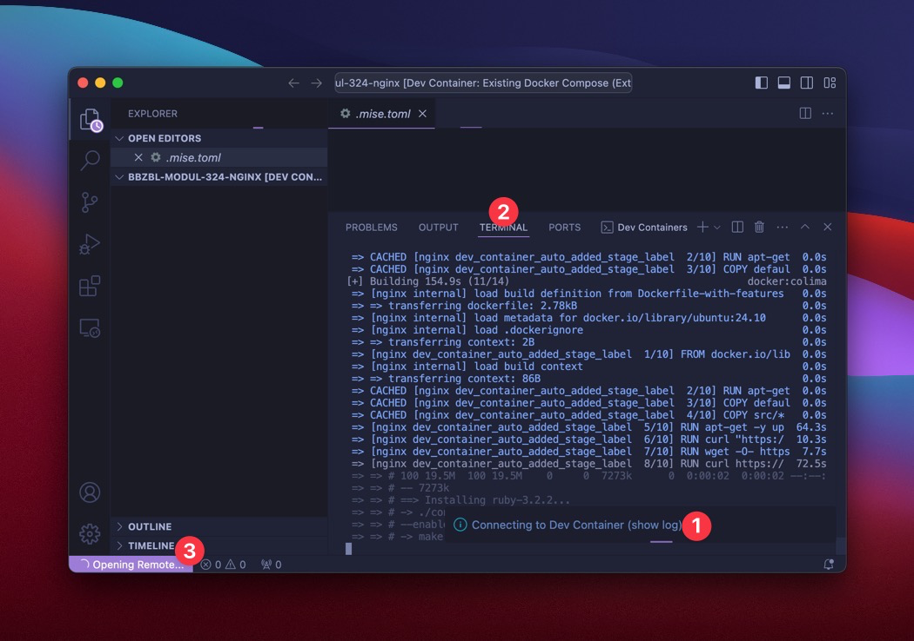
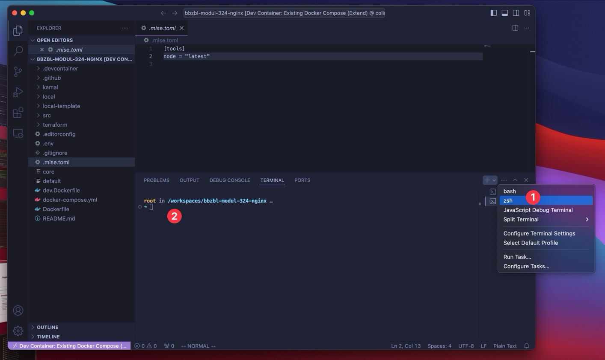

# Devcontainer einrichten

Der Devcontainer wird durch das Dockerfile unter `.devcontainer/Dockerfile`
beschrieben. In dem `Dockerfile` können Tools installiert und konfiguriert
werden, die fürs Projekt nötig sind. Dies erleichtert den Einstieg für neue
Projektmitglieder und **garantiert dass alle die gleiche Umgebung haben**.

:::note Kein must!

Theoretisch könnte auch jeder Projektmitarbeiter alle Tools `nodejs`, `java` und
co. selbst installieren. Hat ja früher auch funktioniert :wink:

- :exclamation: **Es muss darauf geachtet werden, dass alle dieselben Versionen
  verwenden**.

:::

:::info Devcontainer vs produktives Docker-Image

- Der Devcontainer (`.devcontainer/Dockerfile`) dient zum entwickeln. Darin wird
  gearbeitet.
  - :bulb: **Der Devcontainer wird lokal gestartet**.
- Das produktive Image (`nginx/Dockerfile`, oder später
  `ihr-projekt/Dockerfile`) ist optimiert. Dieses sollte so klein wie möglich
  sein und nur das nötigste beinhalten. Meisten z.B. die gebaute Applikation
  (ohne node_moduls und co.) und nicht der dev Build.
  - :bulb: **Das produktive Image wird als Container auf AWS gestartet**.

:::

## Aufgaben

### Mit `docker compose` den Devcontainer starten und prüfen

- Den Devcontainer starten
  ```bash
  docker compose up devcontainer -d
  ```
- Mit `docker exec` eine shell im Container öffnen
  ```bash
  docker exec -it devcontainer /bin/bash
  ```
- Im Container den `nginx` starten:
  ```bash
  chmod +x nginx/scripts/start-nginx.sh # evt. nicht nötig, schadet aber nicht
  sh nginx/scripts/start-nginx.sh
  ```
- Prüfen ob der Webserver läuft.
  ```bash
  curl http://localhost:3000
  ```

  - :bulb: Mit `curl` kann man beliebige HTTP Request absetzen. `curl` wird
    daher oft fürs testen verwendet

:::caution Port 3000 muss frei sein

Wenn auf dem Port 3000 bereits ein Prozess läuft, muss dieser gekillt werden

<details>
<summary>Windows</summary>

```powershell
$ netstat -ano | findstr :3000
>TCP     0.0.0.0:3000    0.0.0.0:0   LISTENING   2660
>TCP     [::]:3000       [::]:0      LISTENING   2660
$ taskkill /PID 2660 /F
```

</details>

<details>
<summary>Linux</summary>

```bash
kill $(lsof -t -i:3000)
```

</details>

<details>
<summary>Docker Container</summary>

Wenn der Port 3000 von einem anderen Docker Container belegt ist muss dieser
gestoppt werden.

```bash
$ docker ps
> CONTAINER ID   IMAGE    COMMAND                 CREATED         STATUS          PORTS                                       NAMES
> 95a55d07e361   a-image   "/bin/sh -c 'while s…"   2 seconds ago   Up 2 seconds   0.0.0.0:3000->3000/tcp, :::3000->3000/tcp  container-name
$ docker stop container-name
```

</details>

:::

:::tip

Natürlich kann man auch via Browser den Webserver testen. Dafür muss
`http://localhost:3000` im Browser geöffnet werden.

:::

### In VS Code Devcontainer starten und prüfen

:::tip

- Bitte startet den Devcontainer zuerst mit `docker compose`.
- VS Code hat nicht so tolle Fehlermeldungen wenn was nicht klappt 🙄

:::

:::caution

- Bitte zuerst
  [alle benötigten VS Code Plugins installieren](/docs/lektionen/woche02/aufgabe-install-tools.md#vs-code-must-have-plugins)

:::

<div className="grid"><div>

VS Code fragt automatisch nach, ob das Projekt im Container geöffnet werden soll
sofern das Plugin "Dev Containers" installiert wurde.

- **"Reopen in Container"** klicken und warten
- Nun wird der Container gebaut und gestartet. **Das kann einige Minuten
  dauern!**

</div><div>


</div></div>

#### Unterdessen...

<div className="grid"><div>

1. Wen auf "Connecting to Dev Container (Show Logs)" geklickt wird
2. erscheint folgender Log. Es zeigt wie das "Image" gebaut wird
3. Unten rechts ist ersichtlich ob VS Code in einem Container geöffnet
   wird/wurde.

</div><div>



</div></div>

#### Terminal öffnen und nginx starten

<div className="grid"><div>

1. Mit `+` kann ein neues Terminal geöffnet werden, _(z.B. zsh oder bash)_
2. Nun existiert ein ubuntu Terminal im Container. <br/> _(selbst unter Windows
   :exploding_head:)_
3. Die Dateien sind verfügbar unter `/workspace`

</div><div>



</div></div>

4. Nginx starten (wie ohne VS Code)
   ```bash
   chmod -x nginx/scripts/start-nginx # evt. nicht nötig, schadet aber nicht
   sh nginx/scripts/start-nginx
   ```
5. Prüfen ob der Webserver läuft.
   ```bash
   curl http://localhost:3000
   ```

### Produktives Dockerfile testen

1. Mit `docker compose` der productive service starten
   ```bash
   docker compose up production -d
   ```
2. In der shell oder im Browser prüfen
   ```bash
   curl http://localhost:3001
   ```

:::info VS Code Devcontainer kann "docker in docker"

- Wenn Ihr ein Terminal im VS Code Devcontainer gestartet habt ist es möglich
  direkt darin mit `docker compose up production -d` zu starten.
  :exploding_head:
- Wenn Ihr den Devcontainer via `docker compose` selbst gestartet habt ist kein
  `docker` verfügbar
  - kein Problem! Ihr könnt auch auf der Machine, in einer zweiten Shell den
    Befehl ausführen

:::
