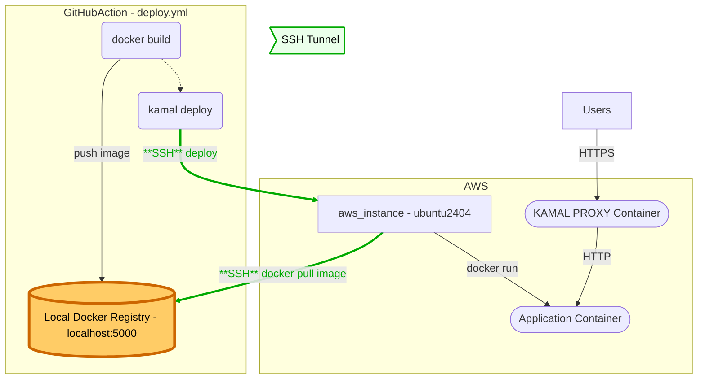

# Mit Lokaler Registry

[Kamal](https://kamal-deploy.org/docs/configuration/docker-registry/#using-a-local-container-registry)
bietet die Möglichkeit das Deployment ohne zentrale (Remote) Docker Registry
durchzuführen. Dies ermöglicht ein automatisiertes Deployment eines Dockerimage
ohne Abhängigkeiten direkt auf eine VM.



## Achtung

:::caution

- Macht diese Aufgabe erst, nachdem das Deployment via
  [AWS Container Registry](./aufgabe-ci-pipeline.md) bereits klappt!

:::

## Anzupassende Dateien

### .github/workflows/deploy.yml

Damit der `docker build` auch eine lokale Registry zur Verfügung hat, muss in
der Github Action eine Docker Registry als `service` gestartet werden. Ein
Service ist ein eigener Prozess, der zusätzlich gestartet wird, wenn die Action
ausgeführt wird. Es können beliebige Docker Images als Service gestartet werden.
Hier wird das Image [`registry:3`](https://hub.docker.com/_/registry) auf dem
Port 5000 gestartet.

```yaml
deploy:
  name: Deploy
  runs-on: ubuntu-latest
  environment: aws
  #highlight-green-start
  services:
    registry:
      image: registry:3
      ports:
        - 5000:5000
  #highlight-green-end
```

Der Login zur Docker Registry auf AWS ist nicht mehr nötig.

```yaml
#highlight-red-start
- name: Login to Amazon ECR
  id: login-ecr
  uses: aws-actions/amazon-ecr-login@v2
#highlight-red-end
```

Dem Docker build muss nun die lokale Registry angegeben werden. Die Registry ist
immer der Anfang (bis zum ersten /) vom Imagename.

```yaml
- name: Docker meta
  id: meta
  uses: docker/metadata-action@v6
  with:
    images: |
      #highlight-red-next-line
      ${{ steps.login-ecr.outputs.registry }}/${{ env.DOCKER_IMAGE_NAME }}
      #highlight-green-next-line
      localhost:5000/${{ env.DOCKER_IMAGE_NAME }}
    tags: |
      type=semver,pattern={{version}},event=tag
      type=sha,event=branch
```

Kamal muss nun über die Umgebungsvariablen `KAMAL_REGISTRY` und
`KAMAL_REGISTRY_PASSWORD` die neue, lokale, Registry mitgeteilt werden. Es
braucht kein Passwort mehr, da es sich um eine lokale Registry handelt.

```yaml
- name: Kamal deploy image
  working-directory: kamal
  env:
    KAMAL_SERVER_IP: ${{ env.SERVER_IP }}
    #highlight-red-start
    KAMAL_REGISTRY: ${{ steps.login-ecr.outputs.registry }}
    KAMAL_REGISTRY_PASSWORD:
      ${{
      steps.login-ecr.outputs[format('docker_password_{0}_dkr_ecr_us_east_1_amazonaws_com',
      secrets.AWS_ACCOUNT_ID)] }}
    #highlight-red-end
    #highlight-green-start
    KAMAL_REGISTRY: "localhost:5000"
    KAMAL_REGISTRY_PASSWORD: ""
    #highlight-green-end
    VERSION: ${{ steps.meta.outputs.version }}
  run: |
    bundle exec kamal deploy --skip-push --version=$VERSION
    echo "Visit me on [http://$KAMAL_SERVER_IP](http://$KAMAL_SERVER_IP) 🚀" >> $GITHUB_STEP_SUMMARY
```

### .github/workflows/aws-infrastructure.yml

Im Workflow "aws-infrastructure.yml" muss ebenfalls eine lokale Registry
erstellt werden. Dies ist nötig, da Kamal beim `kamal server bootstrap` die
Dockerumgebung prüft. Hier müssen also die gleichen Anpassungen gemacht werden.

```yaml
deploy:
  name: Deploy
  runs-on: ubuntu-latest
  environment: aws
  #highlight-green-start
  services:
    registry:
      image: registry:3
      ports:
        - 5000:5000
  #highlight-green-end
```

```yaml
#highlight-red-start
- name: Login to Amazon ECR
  id: login-ecr
  uses: aws-actions/amazon-ecr-login@v2
#highlight-red-end
```

```yaml
- name: Docker meta
  id: meta
  uses: docker/metadata-action@v6
  with:
    images: |
      #highlight-red-next-line
      ${{ steps.login-ecr.outputs.registry }}/${{ env.DOCKER_IMAGE_NAME }}
      #highlight-green-next-line
      localhost:5000/${{ env.DOCKER_IMAGE_NAME }}
    tags: |
      type=semver,pattern={{version}},event=tag
      type=sha,event=branch
```

```yaml
- name: Bootstrap Kamal
  working-directory: kamal
  env:
    KAMAL_SERVER_IP: ${{ needs.terraform.outputs.server-ip }}
    #highlight-red-start
    KAMAL_REGISTRY: ${{ steps.login-ecr.outputs.registry }}
    KAMAL_REGISTRY_PASSWORD:
      ${{steps.login-ecr.outputs[format('docker_password_{0}_dkr_ecr_us_east_1_amazonaws_com',
      secrets.AWS_ACCOUNT_ID)] }}
    #highlight-red-end
    #highlight-green-start
    KAMAL_REGISTRY: "localhost:5000"
    KAMAL_REGISTRY_PASSWORD: ""
    #highlight-green-end
  run: |
    # Ensures that all Servers have docker installed
    bundle exec kamal server bootstrap
```

### terraform/main.tf

Da es keine Docker Registry auf AWS mehr braucht, kann diese in der Terraform
Datei `main.tf` ebenfalls gelöscht werden.

:::info[löscht nicht automatisch]

- Um diese auf AWS wirklich zu entfernen, muss sie im Management Web GUI von
  Hand gelöscht werden. Die Änderung hier garantiert nur, dass sie nicht wieder
  erstellt wird.

:::

```tf title="terraform/main.tf"
...

#highlight-red-start
# Container Registry auf AWS ------------------

# INFO : https://registry.terraform.io/providers/hashicorp/aws/latest/docs/resources/ecr_repository
resource "aws_ecr_repository" "myecr" {
  name                 = "m324/myapp"
  image_tag_mutability = "MUTABLE"
  force_delete         = true
  encryption_configuration {
    encryption_type = "KMS"
  }
  image_scanning_configuration {
    scan_on_push = true
  }
  tags = {
    App = "myapp"
  }
}
#highlight-red-end
```

### kamal/config/deploy.yml

Die Lokale Registry hat keinen Benutzer und Password mehr. Es gibt Probleme,
wenn diese in der Kama-Konfiguration noch definiert sind. Deswegen können
folgende Zeilen gelöscht oder auskommentiert werden.

```yaml title="kamal/config/deploy.yml"

...
# Anmeldeinfos für die Docker Registry. Bei uns ein aws_ecr_repository
registry:
  # Specify the registry server, if you're not using Docker Hub
  server: <%= ENV.fetch('KAMAL_REGISTRY') || 'not-defined' %>
  #highlight-red-start
  username: AWS

  # Always use an access token rather than real password when possible.
  password: <%= ENV.fetch('KAMAL_REGISTRY_PASSWORD') || 'not-defined' %>
  #highlight-red-end
```
