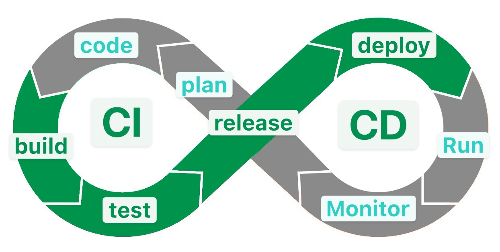

<!-- _class: big center -->

# Woche 6

## CI / CD - Pipeline

### Modul 324

---

## CI - Continious Integration



**build** - des Programmcodes<br/> `npm run build`, `mvn build`

**test** - des Programmcodes<br/> `npm run test`, `mvn test`

**release** - erstellt das docker images<br/> `docker build`

## CD - Continious Delivery

**deploy** - docker images nach AWS<br/> `kamal deploy` oder andere

---

# 🧰 Tools

::: columns

## CI (und CD)

- [GitHub Actions](https://docs.github.com/en/actions)
- [GitLab CI](https://docs.gitlab.com/ee/ci/)
- [Jenkins](https://www.jenkins.io/)

::: split

## CD only

- [ArgoCD](https://argo-cd.readthedocs.io/en/stable/)

:::

---

# GitHub Actions

- Führen anhand von Events, Workflows aus
- Workflows sind Scripts welche auf GitHub, in Container ausgeführt werden
- [GitHub Action Workflows](https://docs.github.com/en/actions/writing-workflows/quickstart)
  befinden sich im Ordner `.github/workflows`
- Jede Datei mit der Endung `*.yml` wird als Workflow ausgeführt
- In unserer Applikation sind das die Dateien
  - `.github/workflows/deploy.yml`
  - `.github/workflows/aws-infrastructure.yml`
  - `.github/workflows/release-please.yml`
- Die Workflows folgen
  [dieser Syntax](https://docs.github.com/en/actions/writing-workflows/workflow-syntax-for-github-actions)

**:tv:
[Erklärt auf Youtube](<[https://www.youtube.com/watch?v=R8_veQiYBjI](https://www.youtube.com/watch?v=R8_veQiYBjI)>)**

---

# GitHub Actions: Syntax

- Die Sprache von Github Actions ist
  [YAML](https://learnxinyminutes.com/docs/yaml/)
  - YAML definiert nur die Struktur und nicht den Inhalt
  - :tv: [Erklärt auf youtube](https://www.youtube.com/watch?v=1uFVr15xDGg)

- GitHub Actions definiert **eigene Keywörter**, welche eine Bedeutung haben.

- Die
  [allgemeine 📜 Syntax](https://docs.github.com/en/actions/writing-workflows/workflow-syntax-for-github-actions)
  ist auf Github dokumentiert

---

# GitHub Actions: Basic file

```yaml
name: GitHub Actions Demo
on: [push]
jobs:
  Explore-GitHub-Actions:
    runs-on: ubuntu-latest
    steps:
      - run: echo "🎉 Hallo ${{ github.event_name }} event."
      - run: echo "🐧 This job is now running on a ${{ runner.os }}"
      - run: echo "🔎 The branch ${{ github.ref }} in ${{ github.repository }}."
      - name: Check out repository code
        uses: actions/checkout@v4
      - run: echo "💡 clone the repository ${{ github.repository }}"
      - run:
          echo "🖥️ The workflow is now ready to test your code on the runner."
      - name: List files in the repository
        run: ls ${{ github.workspace }}
```

---

# GitHub Actions: Kontext

- Es gibt viele
  [Kontext-Variablen](https://docs.github.com/en/actions/writing-workflows/choosing-what-your-workflow-does/accessing-contextual-information-about-workflow-runs)
  in GitHub Actions

- Sie werden in doppelt geschweiften Klammen geschrieben<br>
  `${{ <Context>.<Variable> }}`

## Wichtigste Kontexte

- [**github**](https://docs.github.com/en/actions/writing-workflows/choosing-what-your-workflow-does/accessing-contextual-information-about-workflow-runs#github-context)
  beinhalten Variablen über den Workflow und die Events die ihn getriggert
  haben.
- [**secrets**](https://docs.github.com/en/actions/writing-workflows/choosing-what-your-workflow-does/accessing-contextual-information-about-workflow-runs#secrets-context)
  beinhalten Environment Variablen die als Secret erstellt wurden.
- [**env**](https://docs.github.com/en/actions/writing-workflows/choosing-what-your-workflow-does/accessing-contextual-information-about-workflow-runs#env-context)
  beinhalten Environment Variablen die nicht vertraulich sind.

---

# Die Datei `deploy.yml`

::: columns

- In eurem Repo existiert bereits die Datei `deploy.yml`
- Dieser wird beim `push` auf den branch `main` ausgeführt

- Es existiert einen Job `deploy` mit folgenden Steps:

::: split s1

- Checkout
- Configure AWS credentials
- Get Server Ip
- Set up Ruby for Kamal
- Login to Amazon Elastic Container Registry
- Push environment variables
- Set up Docker Buildx
- Docker meta
- Build and push
- **Kamal deploy image**

:::

---

<!-- _class: big center -->

# Wo builden wir nun den Code?

---

<!-- _class: big center -->

# Im Dockerfile!

---

# :pencil: Aufgabe 1: App auf AWS deployen

- Finalisiert das Dockerfile mit den Anforderungen:
  - Muss den **TCP Port 3000** exposen

  - Muss auf dem Port 3000 einen **Webserver** serven.

  - Muss auf dem Port 3000 eine Route **/up** besitzen die ein Status 200 OK
    zurückgibt.

- Kopiere die AWS credentials in GitHub Repository
- Nun sollte die App auf AWS deployed werden!
