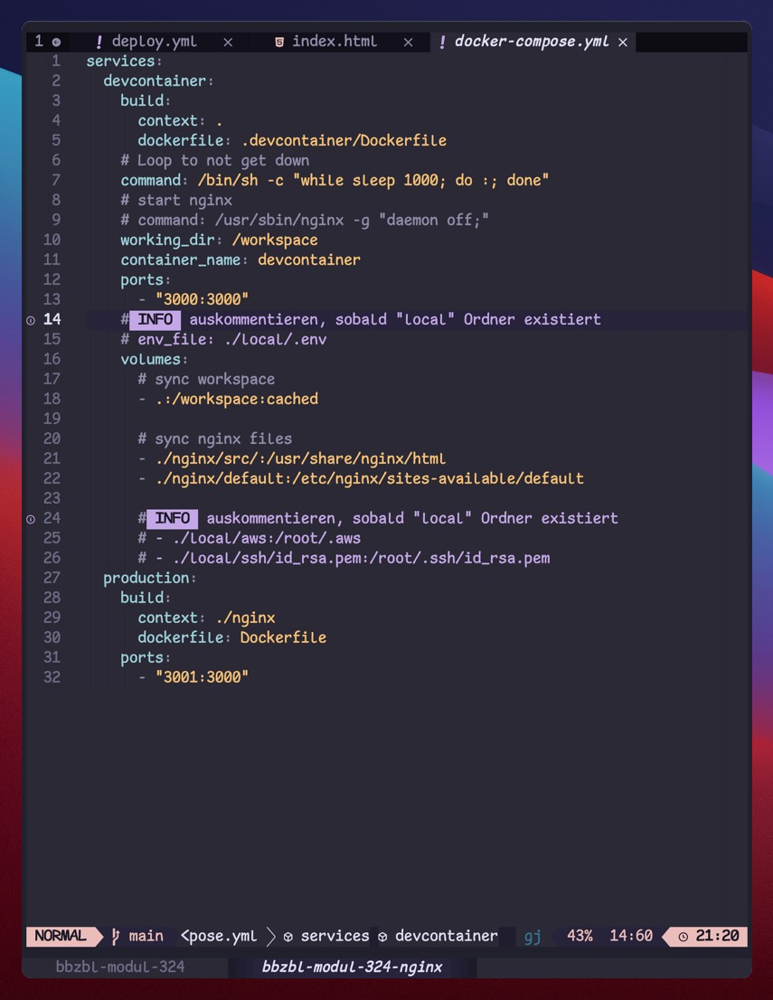
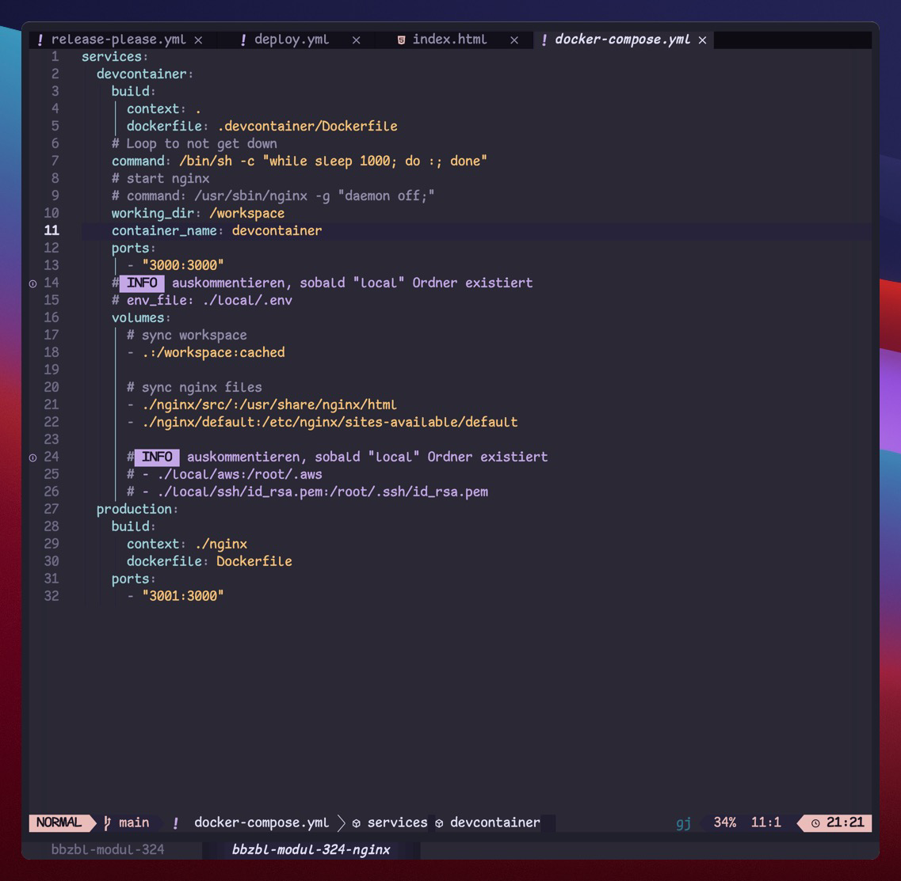
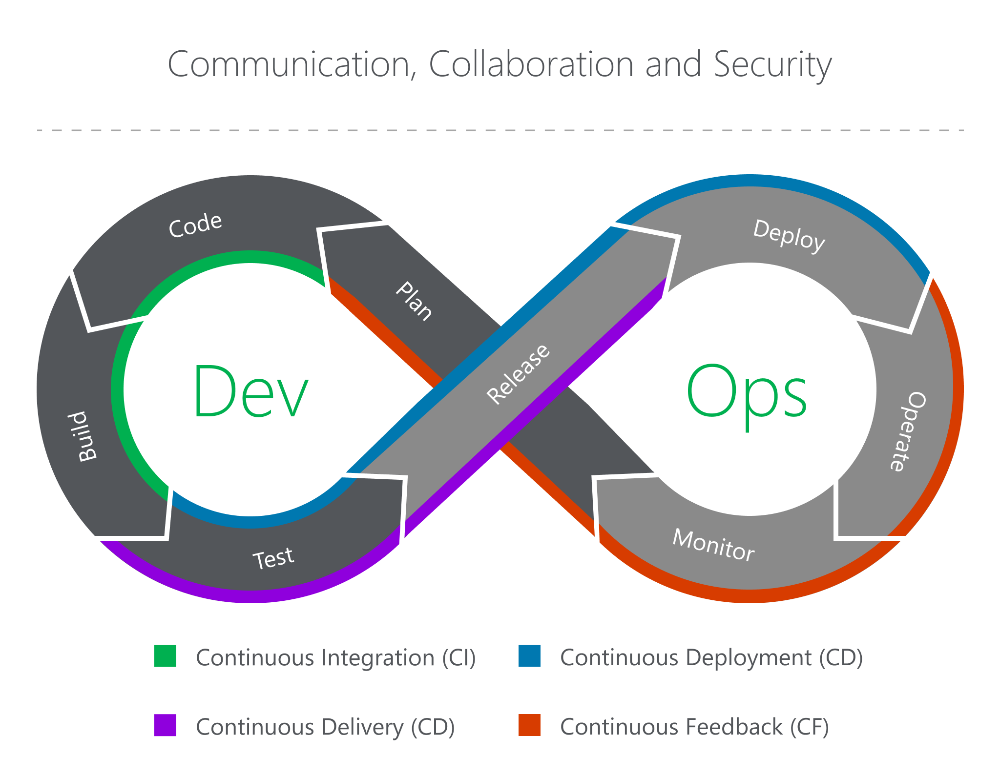

<!-- _class: big center -->

# DevOps

---

# :pencil: Aufgabe 1: **Von der Idee zum Produkt**

::: columns l65

1. Zufällige 4er Gruppen

2. Plakat erstellen über die Schritte welche nötig sind um Programmcode von der
   Idee bis zum Kunde zu bringen.
3. Präsentieren im Plenum

::: split light-bg

- 🕵️ _"Gruppenarbeit"_

- :clock2: **30 Minuten**
- :toolbox: Plakat
- :dart: Vorwissen abfragen

:::

---

<!-- _class: big center -->

# Development

## Software Entwickelung

---

# Projektmanagement

- Anforderungsanalyse
- Arbeitspakete
- Prozesssteuerung

### Oder auch

* :ear: Den Kunden verstehen wollen
* :label: Post-its voll malen
* :construction_worker: Delegieren!

<!-- https://www.pexels.com/de-de/foto/marketing-mann-person-geschaft-7710088/ -->

---

# Programmieren

<!--  -->

- Neue Software erschaffen
- Bestehende Software verbessern/erweitern

### Oder auch

* :zany_face: Spass haben
* :upside_down_face: Kreativ sein!
* 🫣 Coding Themes ausprobieren

---

# Qualitätsmanagement

- Automatische Tests
- Nomenklatur (Formatierung)
- Codequalität garantieren (Linting)

### Oder auch

* :tooth: auf den Zahn fühlen
* :cop: pingelig sein

<!-- https://www.pexels.com/de-de/foto/kind-zahne-zahnpflege-uberprufung-6502552/ -->

---

# Ausliefern

<!--  -->

- Software bauen
- Images erstellen (Containerisieren)
- In Betrieb nehme

### Oder auch

* :seedling: Ein Samen setzen
* :shamrock: Software ist im stetigen Wandel

<!-- https://www.pexels.com/de-de/foto/man-planting-plant-169523/ -->

---

<!-- _class: big center -->

# Operations

## IT Betrieb

---

# Infrastruktur

- Hardware
- Virtuelle Maschinen
- Cloud

<!-- https://www.pexels.com/de-de/foto/nahaufnahme-foto-von-mining-rig-1148820/ -->

---

# Service

- Picketdienst
- Monitoring
- Backup / Failure recovery

<!-- https://www.pexels.com/de-de/foto/graustufenfoto-von-feuerwehrleuten-266403/ -->

---

# Apps betreiben

## Konventionell

- Artefakte (.jar / .war / Quellcode)
- Manuelle Konfiguration der Servers

## Container

- Docker / Images
- Docker Compose / Swarm
- Kubernetes / OpenShift

<!-- https://www.pexels.com/de-de/foto/mann-person-metall-pflanze-5846114/ -->

---

<!-- _class: big center -->

# Was ist nun **DevOps?**

---

<!-- _class: big center -->

# DevOops

Laut [Wikipedia](https://en.wikipedia.org/wiki/DevOps) existiert **keine
universelle Definition** vom Begriff _**DevOps**_.

---

<!-- _class: big center -->

# :scream_cat:

Der Begriff ist **nicht geschützt**!

Es handelt sich um ein sogenanntes
[Buzzword](https://en.wikipedia.org/wiki/Buzzword)!

---

<!-- _class: big center -->

# Wieso haben wir dann ein Modul dafür?

---

<!-- _class: big center emoji-list -->

# DevOps / **Prinzipien**

DevOps verbindet den **IT-Betrieb** mit der **Software Entwicklung** durch

- Geteilte Verantwortung :key:
- Arbeitsprozess Automatisierung :robot:
- Schelles Feedback :boomerang:

---

<!-- _class: big center emoji-list -->

# :superhero_woman: :superhero:

# **Jeder** kann und kennt alles

- Kein Gärtchendenken
- Kein Verantwortung-Abschieben
- **Kein Problem Ferien zu machen**

---

<!-- _class: big center emoji-list -->

# :robot:

# **Mr. Robot** hilft dabei!

- Keine repetitiven Tasks
- Konventionen werden eingehalten
- Flüchtigkeitsfehler werden vermieden

---

<!-- _class: big center emoji-list -->

# :crown:

# **Kunde** hilft dabei!

- Schnelles Feedback
- Hohe Zufriedenheit
- Hohes Vertrauen

---

---

<!-- _class: big center emoji-list -->

# DevOps ist ein Mindset

- Ausfallsicherheit
- Risikominimierung
- Kundenzufriedenheit
- Mitarbeiterzufriedenheit
