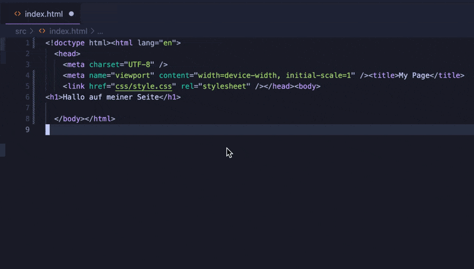

<!-- _class: big center -->

# Formatierung

## Modul 324

---

# Was ist Formatierung?

Definition der **Darstellung des Codes** durch

- **Leerzeichen**

- **Einzüge**
- **Zeilenumbrüche**



---

# Ziele der Formatierung

::: columns

- Lesbarkeit

- Wartbarkeit
- Konsistenz

### Tastenkürzel

> - Windows: `Shift` + `Alt` + `F`
> - Mac: `Shift` + `Option` + `F`
> - Linux `Ctrl` + `Shift` + `I`

::: split

# <!--fit --> 💅

:::

---

# Formatierungsregeln

::: columns

- Es gibt in diesem Kurs keine verpflichtende Vorgabe.

- Je nach Programmiersprache gibt es eigene Standards.
- Nehmt am besten den Standard vom Framework! ==z.B. **Prettier**==

::: split

## Gängige Plugins

- [Google Java Format](https://marketplace.visualstudio.com/items?itemName=wx-chevalier.google-java-format)
- [Prettier (JS/TS)](https://marketplace.visualstudio.com/items?itemName=esbenp.prettier-vscode)

:::

---

# Format On Save

`Code -> Settings -> Format On Save`

Wenn `Format On Save` aktiviert ist, wird automatisch formatiert, sobald die
Datei gespeichert wird.


---

# .editorconfig

::: columns

- Hilft **konsistente Coding-Styles** zu definieren.

- Funktioniert in unterschiedlichen Editoren.
- Einfach lesbar.
- **Angular erstellt ein `.editorconfig`!**

::: split

```editorconfig
# .editorconfig

root = true

[*]
charset = utf-8
indent_style = space
indent_size = 2
insert_final_newline = true
trim_trailing_whitespace = true
end_of_line = lf

...
```

:::

::: footnotes

[https://editorconfig.org/](https://editorconfig.org/)

:::

---

<!-- _class: big -->

# :bulb: Merken

- ### Syntaktisch falscher Code kann nicht formatiert werden
- ### Formatierung zeigt Professionalität
