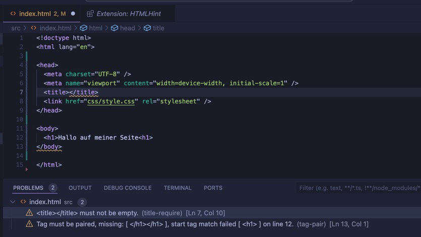

<!-- _class: big center -->

# Linting 

## Modul 324

---

# Was ist Linting?

Garantiert die **funktionale Korrektheit** durch das Identifizieren von:

- **funktionellen Fehlern**
- **stilistischen Problemen**
- **unsicheren Praktiken**

## Gängige Plugins

- [ESLint](https://marketplace.visualstudio.com/items?itemName=dbaeumer.vscode-eslint)
- [SonarQube for IDE](https://marketplace.visualstudio.com/items?itemName=SonarSource.sonarlint-vscode)



---

# :dart: Ziele vom Linting

::: columns

- **Konformität und Standards**

- **einheitliche Qualität**
- **Sicherheit** -> _DevSecOps_

::: split

# <!-- fit --> 👮

:::

---

# ES Lint für Angular installieren

- `ng lint` -> alles mit "yes" akzeptieren
  - Es werden alle Dateien zur Konfiguration erstellt

- im `package.json` folgendes Script ergänzen

  `"lint:ci": "ng lint --output-file eslint_report.json --format json"`
  - Schreibt das Resultat in eine Datei `eslint_report.json`

- in der Github Action `./github/workflows/deploy.yml` vor dem testen linten
  - Beispiel folgt auf der nächsten Folie

---

# ES Lint für Angular in der Github Action

```yaml
# ...
test:
  name: Lint & Test
  runs-on: ubuntu-latest
  steps:
    # ...
    - name: Lint
      working-directory: neues-projekt
      run: npm run lint:ci # neues script!
    - name: Annotate Code
      uses: DerLev/eslint-annotations@v2 # Action für Anmerkungen am PR
      with:
        eslint-report: neues-projekt/eslint_report.json
      continue-on-error: true
    # ...
```

---

<!-- _class: big -->

# :bulb: Merken

- ### Syntaktisch falscher Code kann geprüft werden
- ### Gängige Strukturfehler werden erkannt (best practices)
- ### Linting erhöht massiv die Sicherheit!
