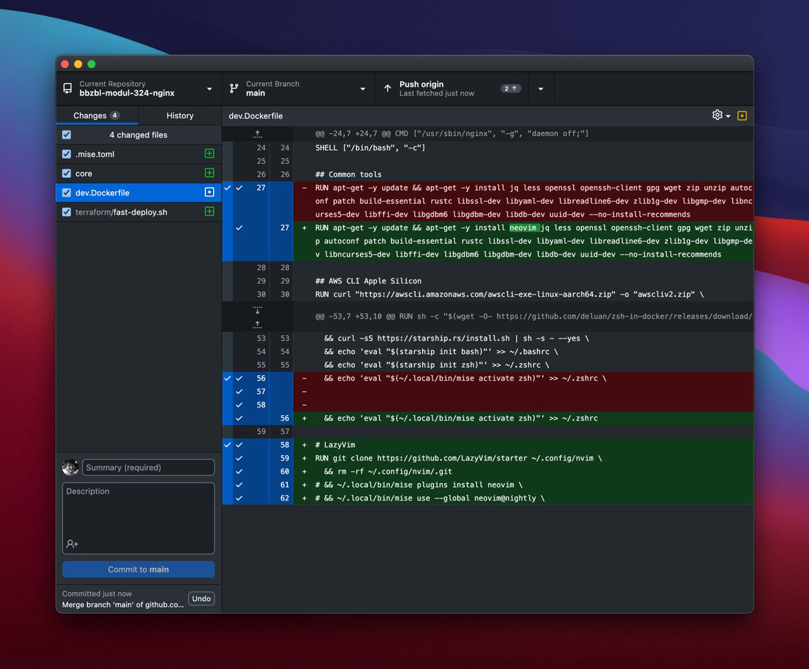
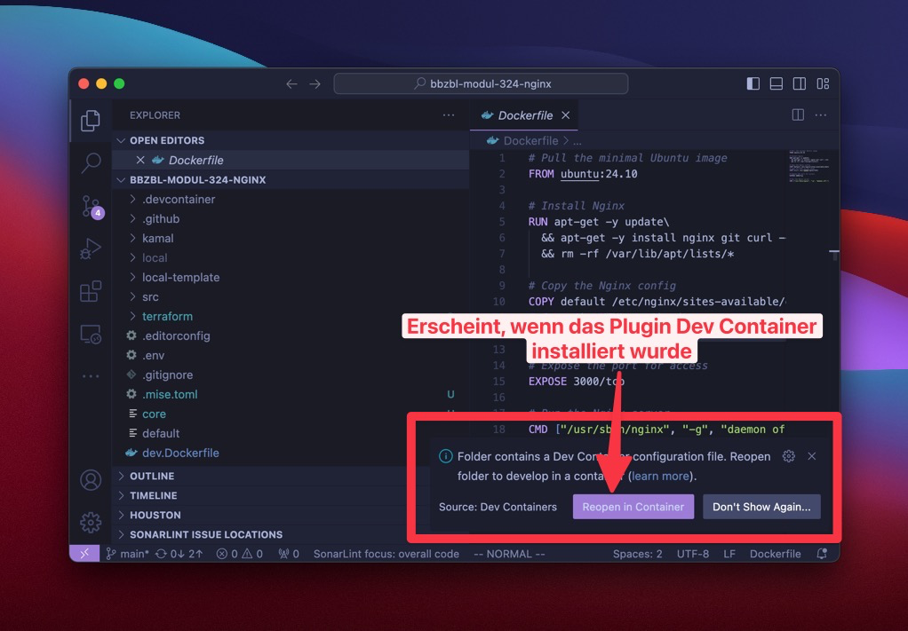

<!-- _class: big center -->

# Woche 3

## Lokales Entwickeln

### Modul 324

---

<!-- _class: big center -->

# Die Idee ist:

## alle haben die gleiche Entwicklungsumgebung, selbst auf Produktion!

## 🥳

---

# Verwendete Tools

- [Docker Desktop](https://www.docker.com/products/docker-desktop/)

- [Docker Compose](https://docs.docker.com/compose/install/)
- [VS Code](https://code.visualstudio.com/)
- [Git](https://github.com/git-guides/install-git#install-git) oder
  [Github Desktop](https://desktop.github.com/download/)


---

# Repository klonen

1. Unter Code Das grüne Dropdown `<> Code` öffnen

2. Die **SSH Url** kopieren
3. oder Sofern [GitHub Desktop](https://desktop.github.com/download/)
   installiert wurde **Open with GitHub Desktop** wählen.


---

# GitHub Desktop

[Github Desktop](https://desktop.github.com/download/) ist ein Grafisches Tool
um git repositories zu verwalten. In Github Desktop kann man mit einem GUI
Commiten.



---

# Öffnen in VS Code

1. `File -> Open folder`

2. Das frisch geklonte repository auswählen

3. Es sollte ungefähr wie rechts aussehen


---

# VS Code Plugins

### Core

- [Dev Containers](https://marketplace.visualstudio.com/items?itemName=ms-vscode-remote.remote-containers)
- [Docker](https://marketplace.visualstudio.com/items?itemName=ms-azuretools.vscode-docker)
- [Remote - SSH](https://marketplace.visualstudio.com/items?itemName=ms-vscode-remote.remote-ssh)

### Linters

- [SonarLint](https://marketplace.visualstudio.com/items?itemName=SonarSource.sonarlint-vscode)
- [HtmlHint](https://marketplace.visualstudio.com/items?itemName=HTMLHint.vscode-htmlhint)


---

# Öffnen in DevContainer

VS Code fragt automatisch nach, ob das Projekt im Container geöffnet werden soll
sofern "Dev Container" installiert wurde.

- **"Reopen in Container"** klicken und warten

- Nun wird der Container gebaut und gestartet. **Das kann einige Minuten
  dauern!**



---

# DevContainer start

1. Wen auf "Connecting to Dev Container (Show Logs)" geklickt wird
2. erscheint folgender Log. Es zeigt wie das "Image" gebaut wird

3. Unten rechts ist ersichtlich ob VS Code in einem Container geöffnet
   wird/wurde.


---

# DevContainer open zsh terminal

1. Mit `+` kann ein neues Terminal geöffnet werden, z.B. (zsh)

2. Nun existiert ein Terminal im Container! So arbeiten alle mit allem.

3. Die Dateien sind "gemountet" unter `/workspaces/[repository-name]`


---

# Docker Compose

```yaml
# docker-compose.yml
services:
  nginx:
    build:
      context: . # Muss zum Ordner mit einem Dockerfile zeigen
      dockerfile: dev.Dockerfile
    container_name: nginx
    ports:
      - "3000:3000"
    env_file: ./local/.env
    volumes:
      - ./src/:/usr/share/nginx/html
      - ./local/aws:/root/.aws
      - ./local/ssh/id_rsa.pem:/root/.ssh/id_rsa.pem
```

- Nginx wird auf port 3000 exposed. Öffnet http://localhost:3000

---

# Installierte tools im Container

Im container sind alle tools vorhanden.

- AWS Cli um nach AWS zu connecten
- Terraform um in AWS die Infrastruktur hochzufahren
- Kamal um ein Dockerfile zu deployen

- und ein Schweizer Sackmesser Tool - [`mise`](https://mise.jdx.dev/)


---

# Installiere Programmiersprachen mit `mise`

### Java

```bash
mise use java
openjdk version "24-loom" 2025-03-18
OpenJDK Runtime Environment (build 24-loom+4-42)
OpenJDK 64-Bit Server VM (build 24-loom+4-42, mixed mode, sharing)
mise java@24.0.0-loom+4-42 ✓ installed
mise /workspaces/bbzbl-modul-324-nginx/.mise.toml tools: java@24.0.0-loom+4-42
```

### NodeJs

```bash
mise use node
mise node@22.7.0 ✓ installed
mise /workspaces/bbzbl-modul-324-nginx/.mise.toml tools: node@22.7.0
```
